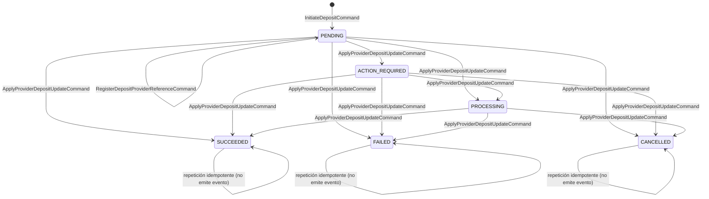

# Contratos iniciales de Finance

- **Estado:** Propuesto para revisión conjunta
- **Versión:** 1.1-inicial
- **Fecha:** 2026-07-26
- **Bounded Context:** Finance
- **Servicio:** `vankoo-finance-service`
- **ADR relacionados:** [ADR-0001](../adr/0001-axon-server-event-store-postgresql-read-model.md) · [ADR-0002](../adr/0002-axon-version-and-server-licensing.md)

## Propósito

Este documento define los contratos iniciales del bounded context Finance antes
de implementar clases, controladores o configuraciones de infraestructura.

El contrato se divide en:

- alcance de negocio y modelo de dominio;
- comandos y eventos de dominio;
- eventos públicos de integración hacia Kafka;
- puerto de aplicación para proveedores de pago;
- consultas, Read Model y tablas operativas;
- reglas de versionado, idempotencia y consistencia.

El dominio no dependerá de Kafka, PostgreSQL, Redis, HTTP ni del SDK de Stripe.
Esos detalles se conectarán desde `application`, `infrastructure` e `interfaces`.
La dependencia de Axon Framework en el dominio se limita a anotaciones de
modelado, según lo justificado en el [ADR-0002](../adr/0002-axon-version-and-server-licensing.md).

---

## Alcance de negocio de la v1

Vankoo es una plataforma de crowdfactoring. El dinero se mueve en cuatro
momentos distintos:

| Movimiento | Dirección | ¿En la v1? |
|---|---|---|
| Recarga de saldo del inversionista | entrante | **Sí** |
| Desembolso a la MYPE | saliente | No |
| Cobranza al deudor de la factura | entrante | No |
| Payout al inversionista | saliente | No |

**La v1 de Finance modela únicamente la recarga de saldo del inversionista.**
El inversionista no paga una factura concreta en el momento: acredita fondos en
su monedero y luego decide en qué operaciones los usa.

Por eso el agregado se llama `Deposit` y no `Payment`. La palabra «pago» queda
reservada para los movimientos salientes, que tendrán su propio contrato y muy
probablemente su propio agregado (payouts y desembolsos usan APIs distintas del
proveedor y tienen un ciclo de vida distinto).

### Frontera explícita con el saldo

```text
Deposit  ──►  ...  ──►  DepositSucceededEvent      ← aquí termina la v1
                                │  (event bus interno de Axon)
                                ▼
                     Wallet / Ledger  (segundo agregado, contrato siguiente)
```

`Deposit` **no acredita saldo**. Solo registra que entró dinero y que el
proveedor lo confirmó.

El saldo es una invariante de negocio: «no puedes invertir más de lo que
tienes». Una invariante no puede validarse contra una proyección, y el saldo
además lo mueven las inversiones y los retiros, no solo las recargas. Por tanto
el saldo debe vivir en su propio agregado event-sourced (`Wallet` o `Ledger`).

**`Wallet` será un segundo agregado dentro del bounded context Finance**, no otro
microservicio. Vankoo sigue la regla «1 microservicio = 1 bounded context», y
saldo y recargas comparten la misma invariante contable: separarlos obligaría a
coordinar dos servicios para acreditar una recarga, con consistencia eventual en
algo que queremos transaccional.

Consecuencia directa: `DepositSucceededEvent` llegará a `Wallet` por el **event
bus interno de Axon**, no por Kafka. Kafka sigue reservado para cruzar la
frontera del bounded context hacia otros servicios de Vankoo.

> **Consecuencia asumida:** en la v1, una recarga exitosa **no deja saldo
> utilizable** para el inversionista. Es una rebanada vertical completa y
> demostrable (comando → invariantes → evento → event store → replay →
> proyección → query), pero no es un flujo de producto cerrado. El agregado
> `Wallet` es el siguiente contrato, no una tarea opcional.

Finance **no** definirá todavía balances contables. La restricción evita que una
proyección de recargas se convierta en una fuente contable implícita.

---

## Convenciones transversales

### Identificadores

**Todos los identificadores son value objects, nunca `String` desnudos.** Es el
patrón de *Business Key Identifier* de la guía (`BookingId` como `@Embeddable`):
el tipo impide confundir un `accountId` con un `depositId` en una firma de método.

**Identificadores propios de Finance — UUID versión 7:**

| VO | Envuelve | Propósito |
|---|---|---|
| `DepositId` | UUIDv7 | Identidad de la recarga. Lo genera Finance antes de enviar el comando de creación. |
| `AccountId` | UUIDv7 | El **monedero del inversionista** que recibirá los fondos. No es un usuario, un JWT ni un identificador del proveedor. |

UUIDv7 en lugar de v4 porque lleva un prefijo temporal y es **ordenable por
tiempo de creación**. Eso da localidad de inserción en los índices B-tree de
`deposit_view` y de las tablas de `finance_ops` —los `INSERT` caen al final del
índice en vez de dispersos, como con v4— y permite ordenar por identificador sin
consultar `created_at`. Se conserva la generación en cliente sin coordinación.

Reglas:

- Se almacenan en PostgreSQL como tipo nativo `uuid`, no como `text`. El
  beneficio de localidad depende del orden de bytes nativo; guardarlos como texto
  lo pierde.
- **UUIDv7 expone la marca de tiempo de creación.** Es aceptable para
  `depositId` y `accountId`, que no son secretos. No se usará UUIDv7 para nada
  que deba ser impredecible o que no deba revelar cuándo se creó.
- La versión del UUID es una decisión de generación, no del contrato de
  transporte: en JSON y en los tags de Axon viajan como string canónico.

**Identificadores ajenos — opacos, nunca UUID:**

| VO | Origen | Regla |
|---|---|---|
| `ProviderDepositId` | asignado por el proveedor | opaco, se almacena tal cual, no se parsea ni valida su forma |
| `ProviderEventId` | evento externo del proveedor | opaco, se usa para deduplicar webhooks |
| `IdempotencyKey` | enviado por el cliente | opaco, no imponemos formato |

Envolverlos en VOs también, pero **sin asumir que son UUID**. Stripe no promete
ningún formato, y validar su forma nos rompería si lo cambia.

> Pendiente: elegir la librería de generación de UUIDv7. El JDK solo genera v4
> (`UUID.randomUUID()`), así que hace falta una dependencia. Se decide en el
> bootstrap (Tarjeta 2).

### Dinero

En el dominio, el dinero es un **value object `Money`** con dos campos:

```java
Money(long amountMinor, Currency currency)
```

Reglas:

- `amountMinor` es una cantidad entera en unidades menores y debe ser mayor que cero;
- no se utilizarán `float` ni `double` para dinero;
- `currency` es ISO 4217 en mayúsculas y debe pertenecer al catálogo soportado;
- una recarga no cambia de moneda después de creada;
- **no se permiten operaciones aritméticas entre `Money` de distinta moneda.** Sumar
  PEN con USD debe fallar en tiempo de ejecución, no convertir en silencio.

**Catálogo soportado en la v1: `PEN` y `USD`.** Se modela como enum en el dominio,
de forma que la invariante 2 se comprueba en compilación y no puede colarse una
moneda sin soporte operativo.

> Soportar dos monedas desde la v1 arrastra dos preguntas al diseño de `Wallet`,
> que quedan abiertas: si el inversionista tiene **un monedero por moneda o uno
> con un saldo por moneda**, y si una recarga en USD puede financiar una factura
> en PEN —lo que introduciría tipo de cambio, que es un tema propio con su
> política de redondeo y su fuente de tasas. Ninguna bloquea la v1 de `Deposit`,
> pero conviene no descubrirlas al empezar `Wallet`.

**En el JSON de eventos y contratos externos, `Money` se serializa aplanado**
como `amountMinor` + `currency`. Se documenta aquí de forma explícita para que
nadie modele dos conceptos distintos: es un único VO con una representación
plana en el borde.

### Fechas y texto

- Las fechas se representan como ISO-8601 en UTC.
- Los textos de dominio deben tener límites definidos por el caso de uso.
- No se almacenarán números de tarjeta, CVV, secretos ni payloads crudos de
  Stripe dentro de eventos de dominio.

---

## Agregado `Deposit`

### Estados



`RegisterDepositProviderReferenceCommand` **no cambia el estado**: aparece como
auto-transición en `PENDING` para dejar claro que existe y que ocurre en
paralelo al ciclo de vida, no dentro de él.

Los estados `SUCCEEDED`, `FAILED` y `CANCELLED` son terminales para la primera
versión. Una modificación posterior, como un reembolso, debe tener un contrato
propio y no reabrir la recarga original.

### Comandos

Los comandos representan intenciones. No son hechos históricos y no se
persisten como eventos.

| Comando | Propósito | Campos obligatorios | Emisor esperado |
|---|---|---|---|
| `InitiateDepositCommand` | Crear una recarga en estado `PENDING`. | `depositId`, `accountId`, `amount`, `provider`, `idempotencyKey`, `requestedAt` | API de Finance |
| `RegisterDepositProviderReferenceCommand` | Asociar a la recarga la referencia creada por el proveedor. | `depositId`, `provider`, `providerDepositId`, `registeredAt` | Caso de uso de recargas |
| `ApplyProviderDepositUpdateCommand` | Aplicar un estado normalizado observado desde un webhook o una consulta al proveedor. | `depositId`, `provider`, `providerDepositId`, `providerEventId`, `status`, `observedAt` | Adaptador de proveedor |

Campos opcionales:

- `description` en `InitiateDepositCommand`;
- `actionUrl` en `RegisterDepositProviderReferenceCommand` cuando el usuario
  deba completar una acción;
- `failureReason` en `ApplyProviderDepositUpdateCommand` cuando el estado sea
  `FAILED`;
- `cancellationReason` cuando el estado sea `CANCELLED`.

El `routingKey` de los comandos dirigidos a una recarga es `depositId`.

### Eventos de dominio

Los eventos representan hechos que ya ocurrieron y forman parte del historial
del agregado en el Event Store.

| Evento | Cuándo se produce | Alcance inicial |
|---|---|---|
| `DepositInitiatedEvent` | Se acepta la creación de la recarga. | Interno |
| `DepositProviderReferenceRegisteredEvent` | Se registra la referencia del proveedor. | Interno |
| `DepositActionRequiredEvent` | El proveedor requiere una acción del usuario. | Público potencial |
| `DepositProcessingStartedEvent` | El proveedor informa que la recarga entró en procesamiento. | Público potencial |
| `DepositSucceededEvent` | La recarga queda confirmada. | Público |
| `DepositFailedEvent` | La recarga queda rechazada o fallida. | Público |
| `DepositCancelledEvent` | La recarga queda cancelada. | Público |

Los nombres expresan lenguaje de negocio en **pasado** —son hechos consumados—
y no contienen `Axon`, `Kafka`, `Stripe`, `Postgres` ni nombres de clases de
infraestructura.

### Datos de los eventos

`DepositInitiatedEvent`:

```json
{
  "depositId": "2b7f1f7d-9f67-4a46-9db8-f44ca7e43d0a",
  "accountId": "8b8c7f7e-f91d-4c13-9f18-1f0e9c8b3d21",
  "amountMinor": 12500,
  "currency": "PEN",
  "provider": "STRIPE",
  "idempotencyKey": "opaque-client-key",
  "description": "Recarga de saldo"
}
```

`idempotencyKey` y `description` se registran aquí y **solo aquí**. La clave da
trazabilidad desde la recarga hasta la petición original del cliente, útil cuando
alguien reclama un cobro duplicado; la descripción es texto del inversionista que
se muestra en su historial. Ninguno de los dos participa en decisiones del
agregado: son datos que el evento conserva, no estado que gobierne transiciones.

`DepositProviderReferenceRegisteredEvent` añade los datos técnicos necesarios
para continuar la integración, y por eso **no se publica**:

```json
{
  "depositId": "2b7f1f7d-9f67-4a46-9db8-f44ca7e43d0a",
  "provider": "STRIPE",
  "providerDepositId": "opaque-provider-reference",
  "actionUrl": "https://provider.example/action/opaque-reference"
}
```

`DepositSucceededEvent` — el hecho que consumirá el futuro `Wallet`:

```json
{
  "depositId": "2b7f1f7d-9f67-4a46-9db8-f44ca7e43d0a",
  "accountId": "8b8c7f7e-f91d-4c13-9f18-1f0e9c8b3d21",
  "amountMinor": 12500,
  "currency": "PEN",
  "provider": "STRIPE"
}
```

`DepositFailedEvent` añade una razón normalizada de Finance:

```json
{
  "depositId": "2b7f1f7d-9f67-4a46-9db8-f44ca7e43d0a",
  "accountId": "8b8c7f7e-f91d-4c13-9f18-1f0e9c8b3d21",
  "amountMinor": 12500,
  "currency": "PEN",
  "provider": "STRIPE",
  "failureReason": "DECLINED"
}
```

Las razones de fallo iniciales son `DECLINED`, `EXPIRED`,
`INVALID_PAYMENT_METHOD`, `PROVIDER_ERROR` y `UNKNOWN`. Los códigos internos de
Stripe no forman parte del contrato de dominio.

---

## Invariantes del agregado

1. Una recarga debe tener `depositId`, `accountId`, importe, moneda y proveedor.
2. El importe debe ser positivo y la moneda debe pertenecer al catálogo soportado.
3. La identidad, el importe, la moneda y la cuenta no pueden cambiar después de
   `DepositInitiatedEvent`.
4. Solo puede registrarse una referencia de proveedor. Repetir exactamente la
   misma referencia es idempotente; intentar registrar otra distinta es un
   conflicto.
5. Una actualización del proveedor debe coincidir con el `provider` y el
   `providerDepositId` registrados **si ya existe un registro**. Si aún no
   existe, se aplica la regla 6.
6. **Actualización anticipada:** si llega una actualización válida antes de que
   se haya registrado la referencia del proveedor, el agregado **no** la aplica
   ni la rechaza definitivamente. El adaptador la aparca y la reintenta (ver
   *Webhooks: inbox, deduplicación y reintentos*). Esto evita depender del orden
   de llegada entre nuestra propia escritura y la del proveedor.
7. Una transición desde un estado terminal no produce ningún evento nuevo. Se
   trata como éxito idempotente, no como error.
8. Un evento externo no modifica directamente una tabla ni un saldo: primero se
   traduce a un comando y el agregado decide qué evento de dominio producir.
9. El agregado no consulta el Read Model, las tablas operativas, Redis, Stripe
   ni Kafka para validar invariantes.

> **Nota sobre deduplicación.** La versión anterior de este contrato exigía que
> el agregado recordase todos los `providerEventId` procesados. Se retira: esa
> lista crece sin cota y encarece cada rehidratación. La deduplicación vive en
> el inbox de webhooks (barrera operativa) y la invariante 7 la respalda dentro
> del dominio (barrera de corrección). Ver la sección de webhooks.

---

## Mapeo de proveedores externos

Stripe y otros proveedores se consideran entradas externas. El adaptador debe
traducir sus estados a la taxonomía de Finance antes de enviar el comando:

| Situación externa normalizada | Estado de Finance |
|---|---|
| Requiere acción del usuario | `ACTION_REQUIRED` |
| En procesamiento | `PROCESSING` |
| Confirmado | `SUCCEEDED` |
| Rechazado o con error definitivo | `FAILED` |
| Cancelado o expirado | `CANCELLED` |

El dominio no recibirá un objeto `Stripe.Event`, `PaymentIntent` ni otro tipo
del SDK. La verificación de firma y la retención temporal del payload crudo
pertenecen a `infrastructure`.

## Contrato del puerto `PaymentProvider`

El puerto vive en `application` y utiliza modelos propios de Finance:

| Operación | Entrada | Salida | Responsabilidad |
|---|---|---|---|
| `createDeposit` | `CreateProviderDepositRequest` | `ProviderDepositCreated` | Crear el recurso de cobro externo. |
| `getDeposit` | `ProviderDepositReference` | `ProviderDepositStatus` | Consultar el estado externo. |
| `verifyWebhook` | Payload crudo + firma | `VerifiedProviderDepositUpdate` | Verificar autenticidad y normalizar el evento. |

El puerto no expone tipos de Stripe. La implementación Stripe vive en
`infrastructure` y traduce los errores del SDK a errores propios de aplicación.

### Errores del puerto

La jerarquía es `sealed` y vive junto al puerto, en `application`. El adaptador
traduce a estos tipos cualquier error del SDK, de modo que ni `application` ni
`domain` ven jamás una excepción de Stripe:

| Error | ¿Reintentable? | Situación |
|---|---|---|
| `PaymentProviderTimeoutException` | Sí | El proveedor no respondió dentro del timeout. |
| `PaymentProviderUnavailableException` | Sí | Proveedor caído o error de servidor. |
| `PaymentProviderRejectedException` | No | Petición inválida, credenciales o regla del proveedor. |
| `InvalidWebhookSignatureException` | No | La firma no valida contra el secreto. |

Un cobro rechazado **no** es una excepción: es un desenlace de negocio y viaja
como `FAILED` dentro de `ProviderDepositStatus`. La distinción importa porque un
rechazo debe producir `DepositFailedEvent`, mientras que un error del puerto no
produce ningún evento de dominio.

### Estrategia de timeout y retry

El puerto no implementa timeout ni retry: eso pertenece al adaptador concreto
(Tarjeta 6), que es quien conoce el transporte. Lo que el puerto sí garantiza es
**señalar** qué fallos son transitorios, mediante la interfaz marcadora
`RetryablePaymentProviderException`. Quien orquesta el caso de uso decide si
reintenta, con qué backoff y cuántas veces, sin inspeccionar mensajes de error
por texto ni acoplarse a tipos concretos.

Regla asociada: **un reintento debe conservar la misma `IdempotencyKey`.** Un
timeout no prueba que la operación no se haya ejecutado del otro lado, así que
reintentar con una clave nueva podría duplicar el cobro.

Valores iniciales, a confirmar en la Tarjeta 6 contra la latencia real de Stripe:

| Parámetro | Valor inicial |
|---|---|
| Timeout de conexión | 5 s |
| Timeout de lectura | 10 s |
| Intentos máximos | 3 (1 original + 2 reintentos) |
| Backoff | exponencial: 200 ms, 400 ms, con jitter aleatorio |

Qué se puede reintentar:

- `getDeposit` siempre: es una lectura idempotente por naturaleza y es además
  el camino de reconciliación cuando un webhook se pierde.
- `createDeposit` solo conservando la misma `IdempotencyKey`.
- `verifyWebhook` nunca: no sale a la red, y sus dos fallos posibles —firma
  inválida o payload corrupto— son definitivos.

Agotados los intentos, el error se propaga: el puerto no traga fallos en
silencio. Quien orquesta decide si aparca la operación o la marca para revisión.

### Idempotencia en `createDeposit`

`CreateProviderDepositRequest.idempotencyKey` es obligatorio. La implementación
Stripe (Tarjeta 6) debe mapearlo al header `Idempotency-Key` de la API de
Stripe.

Es una barrera distinta de la de `finance_ops.deposit_command_idempotency`: esa
evita que el **cliente** cree dos recargas; esta evita que **Finance** cree dos
recursos de cobro en el proveedor al reintentar.

### Representación del dinero en el puerto

El puerto usa `amountMinor` + `currency` aplanados, no un value object `Money`,
porque `Money` es del dominio y todavía no existe. Es la misma representación
plana que el contrato ya fija para el JSON de eventos y para Kafka, así que no
introduce un concepto nuevo. Al llegar `Money`, el puerto puede adoptarlo sin
cambiar su semántica.

El puerto valida solo la **forma** ISO 4217 (tres letras). Que la moneda
pertenezca al catálogo soportado es una invariante de negocio y la comprueba el
agregado antes de que se invoque el puerto: repetirla aquí duplicaría una regla
que no pertenece a esta capa.

---

## Webhooks: inbox, deduplicación y reintentos

Todo webhook entrante pasa por una **tabla inbox** antes de convertirse en
comando. Un único componente resuelve tres problemas: deduplicación, llegada
anticipada y reintentos.

```text
finance_ops.provider_webhook_inbox
  UNIQUE(provider, provider_event_id)     -- deduplicación
  payload_ref                             -- referencia al payload retenido
  status        RECEIVED | APPLIED | PARKED | DISCARDED
  attempts, next_attempt_at, last_error
  deposit_id                              -- resuelto, si se conoce
```

Flujo:

1. `interfaces` recibe el HTTP y conserva el payload crudo y la firma.
2. `infrastructure` verifica la firma **antes** de interpretar el payload.
3. Se intenta insertar en el inbox. Si `(provider, provider_event_id)` ya
   existe, es un duplicado: se responde `200` y **no** se emite comando.
4. Se resuelve el `depositId` a partir del `providerDepositId`.
   - Si se resuelve, se emite `ApplyProviderDepositUpdateCommand` y la fila
     pasa a `APPLIED`.
   - Si no se resuelve todavía (la referencia aún no se ha registrado), la fila
     pasa a `PARKED` con `next_attempt_at` y se reintenta con backoff
     exponencial.
5. Agotados los reintentos, la fila queda `PARKED` para revisión manual y
   dispara una alerta. Nunca se crea una recarga desde un webhook.

Reglas:

- Un webhook repetido no produce un nuevo evento de negocio.
- Un webhook válido para una recarga inexistente no crea la recarga.
- El `providerEventId` es obligatorio.
- La respuesta HTTP al proveedor no espera al procesamiento del comando.

**Triple barrera:** la restricción única del inbox evita el trabajo repetido, el
camino `PARKED` + reintento resuelve el orden de llegada, y la invariante 7
garantiza la corrección aunque un duplicado se cuele (un `SUCCEEDED` sobre una
recarga ya `SUCCEEDED` no emite evento).

El flujo completo, con sus ramas de firma inválida, duplicado, llegada
anticipada y estado terminal, está en
[`uml/finance-webhook-sequence-diagram.puml`](../uml/finance-webhook-sequence-diagram.puml).

### Idempotencia de comandos de cliente

```text
finance_ops.deposit_command_idempotency
  UNIQUE(account_id, idempotency_key)
  stores(deposit_id, request_hash)
```

- `Idempotency-Key` es obligatorio para iniciar una recarga.
- La misma clave con el mismo contenido devuelve el mismo `depositId`.
- La misma clave con contenido distinto produce un conflicto (`409`).

### Resolución de referencias del proveedor

```text
finance_ops.deposit_provider_reference
  UNIQUE(provider, provider_deposit_id) -> deposit_id
```

> **Estas tres tablas viven en el schema `finance_ops`, no en
> `finance_read_model`.** No son proyecciones de consulta: son infraestructura
> operativa del borde. La distinción es deliberada, porque el ADR-0001 prohíbe
> usar el Read Model para validar invariantes, y estas tablas sí participan en
> decisiones de admisión. Son reconstruibles a partir del historial de eventos y
> del log de webhooks, y su pérdida degrada las garantías de deduplicación pero
> no corrompe el historial.

---

## Eventos de integración hacia Kafka

### Selección

Se publican **solo los desenlaces**, que son los hechos que otro bounded context
puede necesitar:

- `DepositSucceededEvent`;
- `DepositFailedEvent`;
- `DepositCancelledEvent`.

El resto son internos, cada uno por su motivo:

| Evento | Por qué no se publica |
|---|---|
| `DepositInitiatedEvent` | Que una recarga *empiece* no es un hecho útil fuera: el monedero solo reacciona cuando termina bien, y vive dentro de Finance. Además lleva `idempotencyKey` y `description`, que son plomería nuestra y texto libre del inversionista: nada que deba cruzar la frontera. |
| `DepositProviderReferenceRegisteredEvent` | Expone una referencia del proveedor. |
| `DepositActionRequiredEvent` | Describe un paso intermedio del flujo de pago, no un hecho de negocio cerrado. |
| `DepositProcessingStartedEvent` | Igual: estado transitorio del proveedor. |

> Esta separación se apoya en la regla del ADR-0001 de que **el evento de dominio
> y el de integración comparten el mismo payload**. Como no hay mapper que recorte
> campos, la única forma de no exponer un dato es no publicar el evento que lo
> lleva. Es una restricción real de esa regla, y `DepositInitiatedEvent` es el
> primer caso donde se nota: si algún día necesitamos publicar un hecho cuyo
> evento de dominio contiene algo privado, habrá que revisar la regla en vez de
> forzar el contrato.

> **Kafka en la v1 no tiene consumidor todavía.** El consumidor natural de
> `DepositSucceededEvent` es `Wallet`, y `Wallet` vive **dentro** de Finance, así
> que lo recibirá por el event bus de Axon. Los consumidores externos llegarán
> cuando otros servicios de Vankoo necesiten estos hechos.
>
> Se mantiene la publicación desde la v1 para fijar el contrato antes de que
> exista el primer consumidor, no porque haya uno. Conviene tenerlo presente al
> priorizar: la Tarjeta 8 entrega infraestructura que nadie consume aún, y podría
> posponerse sin bloquear ningún flujo de producto.

La regla es: un evento de dominio público y su evento de integración comparten
el mismo payload de negocio. No se publican mensajes técnicos de Axon, clases
serializadas con el nombre completo del paquete ni objetos del SDK de Stripe.

### Topic y clave

- **Topic inicial:** `vankoo.finance.events.v1`
- **Key del registro:** `depositId`
- **Formato:** JSON
- **Entrega:** al menos una vez
- **Orden:** garantizado por Kafka para registros con la misma key, sujeto a la
  configuración de particiones

### Headers de Kafka

Los metadatos técnicos viajan en headers, no dentro del objeto de dominio:

| Header | Obligatorio | Descripción |
|---|---:|---|
| `event-type` | Sí | Nombre del evento, por ejemplo `DepositSucceededEvent`. |
| `event-version` | Sí | Versión del esquema, inicialmente `1`. |
| `event-id` | Sí | Identificador único del evento para deduplicación. |
| `aggregate-type` | Sí | Inicialmente `Deposit`. |
| `aggregate-id` | Sí | Igual a `depositId`. |
| `occurred-at` | Sí | Fecha UTC en formato ISO-8601. |
| `correlation-id` | Sí | Identifica la operación de negocio completa. |
| `causation-id` | No | Identifica el mensaje que causó este evento. |
| `content-type` | Sí | `application/json`. |

El `event-id` debe conservarse durante los reintentos del productor. Los
consumidores deben deduplicar por `event-id` o por una clave de negocio
equivalente.

### Ejemplo de registro Kafka

Headers:

```text
event-type: DepositSucceededEvent
event-version: 1
event-id: 1b8ed1ab-3ab9-4f8e-ae2e-9e158a3de8de
aggregate-type: Deposit
aggregate-id: 2b7f1f7d-9f67-4a46-9db8-f44ca7e43d0a
occurred-at: 2026-07-26T15:30:00Z
correlation-id: 9fd7498c-8125-4a2c-88d4-ccbfecfd1a1a
content-type: application/json
```

Payload:

```json
{
  "depositId": "2b7f1f7d-9f67-4a46-9db8-f44ca7e43d0a",
  "accountId": "8b8c7f7e-f91d-4c13-9f18-1f0e9c8b3d21",
  "amountMinor": 12500,
  "currency": "PEN",
  "provider": "STRIPE"
}
```

### Compatibilidad y versionado

- Los eventos del Event Store y los contratos Kafka se versionan de forma explícita.
- En la versión `1`, los consumidores deben tolerar campos nuevos que no utilicen.
- Eliminar o renombrar un campo obligatorio requiere una nueva versión mayor.
- No se cambia silenciosamente el significado de un evento existente.
- Migrar eventos históricos requerirá upcasters o una estrategia equivalente
  antes de modificar el agregado.

---

## Read Model y consultas

El Read Model de PostgreSQL es una proyección, no una segunda fuente de verdad.
La primera proyección es `finance_read_model.deposit_view`:

| Campo | Propósito |
|---|---|
| `deposit_id` | Identificador de la recarga. |
| `account_id` | Monedero asociado. |
| `amount_minor` | Importe en unidades menores. |
| `currency` | Moneda ISO 4217. |
| `provider` | Proveedor normalizado. |
| `provider_deposit_id` | Referencia externa, si existe. |
| `description` | Texto del inversionista, para su historial. |
| `status` | Estado actual de Finance. |
| `action_url` | URL de acción, si aplica y sigue vigente. |
| `failure_reason` | Razón normalizada, si la recarga falló. |
| `created_at` | Fecha de creación. |
| `updated_at` | Fecha de última proyección. |
| `last_event_id` | Último evento aplicado, para idempotencia de la proyección. |
| `projection_version` | Versión de la proyección. |

La proyección debe poder eliminarse y reconstruirse por completo reproduciendo
el historial de eventos.

### Consultas lógicas iniciales

- `GetDepositById(depositId)`
- `ListDepositsByAccount(accountId, filters, page)`

Las consultas no reconstruyen el agregado desde el Event Store. Leen el Read
Model y aceptan consistencia eventual después de un comando o una proyección
reprocesada.

### Los tres tipos del lado de lectura

Una consulta atraviesa tres tipos distintos, uno por capa. Se documentan porque
sus nombres se parecen y confundirlos es fácil:

| Tipo | Capa | Qué es | Cambia cuando… |
|---|---|---|---|
| `DepositViewEntity` | `infrastructure/persistence/jpa` | la `@Entity` que mapea la tabla `deposit_view`, con `last_event_id` y `projection_version` | cambia el almacén |
| `DepositSummary` | `domain/model/queries` | qué datos pide el negocio, compuesto de value objects | cambia el negocio |
| `DepositResource` | `interfaces/rest/resources` | el JSON de la respuesta HTTP | cambia el contrato de la API |

**«Read Model» se reserva para el almacén**, nunca para un tipo Java. Es el
vocabulario de la guía, que rotula la caja de la figura 6-7 como *"Read Model
(Traditional Datastore)"*.

El mapeo columna ↔ value object se declara **una sola vez** con
`AttributeConverter` de JPA en `infrastructure/persistence/jpa/converters`, para
que los value objects de dominio no lleven ninguna anotación de JPA y para no
escribir el mapeo query por query.

> **Decisión abierta.** Esta separación en tres tipos está sujeta a revisión.
> La alternativa es que `DepositQueryService` viva solo en `application` y
> devuelva directamente la `@Entity`, quedándose en dos tipos. Es más ligero y
> es lo que sugiere la figura 6-7, que no modela ningún tipo de retorno.
>
> Se elige la separación en tres porque la interfaz del query service vive en
> `domain/services` —siguiendo el modelo de referencia de la clase— y el dominio
> no puede depender de infraestructura. La alternativa además añadiría una
> arista `interfaces → infrastructure`, que hoy no existe, y expondría la
> `@Entity` a la serialización JSON.
>
> Si al implementar la Tarjeta 4 el tercer tipo resulta puro peso muerto, la
> salida es mover `DepositQueryService` fuera del dominio y borrar
> `DepositSummary`. Ninguna de las dos opciones afecta a los eventos, al event
> store ni a los contratos de Kafka.

### HTTP como adaptador

Los nombres de ruta son contratos lógicos y pueden recibir un prefijo del API
Gateway:

| Método | Ruta lógica | Resultado |
|---|---|---|
| `POST` | `/v1/deposits` | Acepta `InitiateDepositCommand`; requiere header `Idempotency-Key`. |
| `GET` | `/v1/deposits/{depositId}` | Devuelve el estado proyectado de la recarga. |
| `GET` | `/v1/accounts/{accountId}/deposits` | Lista paginada de recargas del monedero. |
| `POST` | `/v1/payment-providers/{provider}/webhooks` | Verifica el webhook y lo deposita en el inbox. |

`POST /v1/deposits` responde `202 Accepted` con `depositId` y estado `PENDING`.
La creación del recurso externo y la actualización del Read Model son asíncronas.

---

## Snapshots

**No habrá snapshots en la v1.** Una recarga tiene entre 2 y 4 eventos en todo
su ciclo de vida y llega rápido a un estado terminal, por lo que rehidratarla
completa es trivial. Se decide explícitamente para que no quede como un silencio
del contrato.

Se reevaluará si aparece un agregado de vida larga —el `Wallet` es el candidato
evidente, porque acumula un evento por cada movimiento.

---

## Organización por capas

Se sigue la estructura de paquetes de la guía de la clase, con los nombres
canónicos de sus figuras 5-10 a 5-14:

```text
com.liquilabs.vankoo.finance
├── interfaces/                    # eje de clasificación: el transporte
│   ├── rest/                      # transporte HTTP
│   │   ├── controllers/           # nuestra API: deposits, accounts
│   │   ├── webhooks/              # callback del proveedor: HTTP, pero no es nuestra API
│   │   ├── resources/             # resources HTTP de entrada/salida
│   │   └── transform/             # DTO assemblers: resource -> command/query
│   └── messaging/                 # transporte de mensajería
│       └── eventhandlers/         # eventos entrantes de OTROS bounded contexts (vacío en v1)
├── application/
│   └── internal/
│       ├── commandservices/   # casos de uso de escritura
│       ├── queryservices/     # proyección (@EventHandler) + query handlers
│       └── outboundservices/  # PaymentProvider port, ACL, publicador de eventos
├── domain/
│   ├── model/
│   │   ├── aggregates/    # Deposit
│   │   ├── entities/      # entidades hijas del agregado (ninguna en la v1)
│   │   ├── commands/      # InitiateDepositCommand, ...
│   │   ├── queries/       # GetDepositByIdQuery, ListDepositsByAccountQuery, DepositSummary
│   │   ├── events/        # DepositInitiatedEvent, ...
│   │   ├── valueobjects/  # DepositId, AccountId, Money, DepositStatus, ...
│   │   └── exceptions/    # excepciones de negocio
│   └── services/          # SOLO interfaces: DepositCommandService, DepositQueryService
└── infrastructure/                # eje de clasificación: rol, luego tecnología
    ├── eventstore/axon/           # conexión, serializer, token store, event processors
    ├── persistence/jpa/
    │   └── repositories/          # read model y tablas operativas
    ├── brokers/kafka/             # productor y binding de canales
    ├── providers/stripe/          # adaptador StripePaymentProvider
    └── configuration/             # configuración técnica transversal
```

Las dos capas de adaptadores usan un **eje de clasificación explícito**, tomado
del patrón de la guía:

- **`interfaces` clasifica por transporte.** `rest` es HTTP y `messaging` es
  broker, hermanos entre sí, como `interfaces.rest` e `interfaces.events` en la
  guía. Los webhooks van **dentro de `rest`** porque comparten transporte —
  necesitan un `@RestController`, un endpoint y un status code — pero en
  subpaquete propio, porque no son nuestra API: retienen payload crudo, verifican
  firma, no usan nuestros resources y responden sin esperar al comando.
- **`infrastructure` clasifica por rol, luego por tecnología**, igual que la guía:
  `brokers/rabbitmq`, `repositories/jdbc`, `services/http`. De ahí
  `eventstore/axon`, `persistence/jpa`, `brokers/kafka`, `providers/stripe`. No
  hay ningún paquete con nombre de tecnología en el primer nivel.

> `persistence/jpa` se llama así, y no `repositories/jpa`, porque cuando aparezca
> la `@Entity` del read model no será ni un repositorio ni dominio, y necesitará
> un hermano de `repositories` bajo la misma tecnología. Hoy no existe todavía y
> el paquete no se crea vacío.

Sobre `domain/model/entities/`: el paquete existe y **no está prohibido usarlo**.
En DDD una entidad es un objeto **con identidad propia** que no encaja como value
object, pero que **no tiene ciclo de vida independiente**: vive sujeto a su
aggregate root, que es su única puerta de entrada. `Deposit` no tiene ninguna en
la v1 —todo su estado son value objects— pero en cuanto aparezca una (por ejemplo
intentos de cobro con identidad propia dentro de una misma recarga), va aquí y no
en `valueobjects`.

Equivalencias y reglas de dependencia:

- `outboundservices` es el nombre de la guía para lo que también llamamos
  «puertos de salida». Se conserva el nombre de la guía.
- **`domain/services` contiene solo interfaces**, y `application/internal/
  {commandservices, queryservices}` sus implementaciones. El dominio declara el
  contrato de los casos de uso; la aplicación lo cumple. `DepositQueryService`
  devuelve `DepositSummary`, no `Deposit`: las consultas leen el read model y
  nunca rehidratan el agregado.
- **Convención de nombres de resources HTTP:** `CreateXResource` para el request,
  `XResource` para el response. Así, `POST /v1/deposits` recibe un
  `CreateDepositResource` y `GET /v1/deposits/{id}` devuelve un `DepositResource`.
- **No hay interfaz de repositorio en el dominio**, a diferencia del modelo de
  referencia. El agregado es event-sourced y no se carga de una tabla, y el read
  model no es un concepto de dominio: su acceso JPA vive en
  `infrastructure/persistence/jpa/repositories`.
- **Hay tres roles de event handler, y la guía clasifica por dirección, no por
  autoría del evento.** Cada uno tiene un ejemplo concreto que lo respalda:

  | Rol | Escucha | Paquete | Ejemplo de la guía |
  |---|---|---|---|
  | Handler de integración | eventos de **otros** BC, vía Kafka | `interfaces/messaging/eventhandlers` | `trackingms.interfaces.events.CargoRoutedEventHandler` |
  | **Proyección** + query handlers | eventos **propios** | `application/internal/queryservices` | Fig. 6-7: el *Event Subscriber* está en el mismo recuadro que *Query Handler* y *Query Model* |
  | Publicador de integración | eventos **propios** | `application/internal/outboundservices` | `bookingms.application.internal.outboundservices.CargoEventPublisherService` |

  La infraestructura solo contiene la superficie de contacto con la tecnología:
  el repositorio JPA (`CargoRepository` → `infrastructure/repositories` en la
  guía, `infrastructure/persistence/jpa/repositories` en Finance) y el binding de
  canales del broker (`CargoEventSource` → `infrastructure/brokers/rabbitmq`).
  Los handlers viven en `application`.

- **La proyección y los query handlers van juntos.** La guía llama *Query Model*
  al conjunto, y el capítulo 6 lo dibuja como una sola unidad. Coincide además
  con el idiom de Axon, donde `@EventHandler` y `@QueryHandler` suelen convivir
  en la misma clase. Se descartó un paquete `infrastructure/projections`: partía
  en dos lo que la guía dibuja unido, sin ganancia.

- **La proyección debe declarar `@ProcessingGroup` explícitamente**, por ejemplo
  `@ProcessingGroup("deposit-read-model")`. El nombre por defecto del processing
  group es el del paquete del handler, y ese nombre queda grabado en el token
  store. Sin declararlo, mover o renombrar el paquete crea un procesador nuevo
  sin token y provoca un replay completo de la proyección.
- Siguiendo la guía, **`application` puede depender de `infrastructure`**
  directamente para repositorios (igual que `CargoBookingCommandService` importa
  `infrastructure.repositories.CargoRepository`). La única inversión deliberada
  es `PaymentProvider`: se declara en `outboundservices` y la implementa
  `providers/stripe`, para que el caso de uso pueda probarse con un fake sin
  Stripe.

Los diagramas correspondientes son
[`uml/finance-package-diagram.puml`](../uml/finance-package-diagram.puml),
[`uml/finance-layers-diagram.puml`](../uml/finance-layers-diagram.puml) y
[`uml/finance-domain-model-diagram.puml`](../uml/finance-domain-model-diagram.puml).

Los DTOs HTTP pueden tener una forma distinta de los comandos de dominio. Los
assemblers de `interfaces` realizan esa traducción.

---

## Desviaciones deliberadas respecto a la guía de clase

Esta sección existe para que en la revisión conjunta quede claro qué es una
decisión y qué sería un descuido. Cada punto es una diferencia intencional
respecto al capítulo 5 de la guía.

### `Deposit` no es una `@Entity` de JPA

En la guía el agregado **es** la tabla:

```java
@Entity
public class Cargo {
    @Id @GeneratedValue(strategy = GenerationType.IDENTITY) private Long id;
    @Embedded private BookingId bookingId;
}
```

En Finance, `domain/model/aggregates/Deposit` **no lleva ninguna anotación de
JPA** y no tiene identificador técnico autogenerado: su identidad es el
`DepositId`, y su estado se reconstruye por replay. La única `@Entity` del
servicio será la fila del read model, bajo `infrastructure/persistence/jpa`.

Consecuencia directa del event sourcing: no hay `deposit_repository.save(deposit)`
en ninguna parte.

### Los identificadores de aggregate viven en `valueobjects`

La guía coloca `BookingId` en `domain.model.aggregates`, junto al agregado que
identifica. Nosotros los agrupamos todos en `valueobjects`, porque tenemos cinco
tipos de identificador y dispersarlos entre paquetes según a quién identifican
haría más difícil encontrarlos.

### No hay módulo `shareddomain`

La guía comparte los eventos entre bounded contexts como **la misma clase Java**:

```java
import com.practicalddd.cargotracker.shareddomain.events.CargoBookedEvent;
```

Tanto el publicador de `bookingms` como el suscriptor de `trackingms` importan ese
módulo compartido. Nosotros usamos **contratos JSON versionados con headers**, sin
ningún artefacto Java común.

Motivo: un cambio en una clase compartida obliga a recompilar y redesplegar todos
los consumidores, lo que acopla los ciclos de release de servicios que deberían
ser independientes. Con un contrato JSON versionado, añadir un campo es
retrocompatible sin tocar al consumidor. El coste es que el contrato no lo
verifica el compilador, y por eso se compensa con las pruebas de contrato de la
Tarjeta 9.

### Un solo topic para todos los eventos, no un canal por evento

La guía declara un canal y un destino por tipo de evento:

```properties
spring.cloud.stream.bindings.cargoBookingChannel.destination=cargoBookings
spring.cloud.stream.bindings.cargoRoutingChannel.destination=cargoRoutings
```

Nosotros publicamos todo en `vankoo.finance.events.v1` y discriminamos por el
header `event-type`.

Motivo: Kafka solo garantiza orden **dentro de una partición**, y la clave de
partición es el `depositId`. Con topics separados por tipo de evento, un consumidor
podría ver `DepositSucceeded` antes que `DepositInitiated` para la misma recarga,
porque viajarían por particiones distintas. Un topic único con clave por agregado
preserva el orden causal de cada recarga.

## Elementos que no son contratos de negocio

No se documentan como eventos adicionales:

- `CommandMessage`, `EventMessage`, sequence number y metadata interna de Axon;
- headers, particiones, offsets y envelopes de Kafka;
- payload crudo, firma y tipos del SDK de Stripe;
- entidades JPA, tablas del Read Model y tablas de `finance_ops`.

Son mecanismos técnicos que transportan, almacenan o proyectan los contratos de
negocio.

---

## Decisiones pendientes

- **Tipos provisionales del puerto `PaymentProvider` (Tarjeta 5, pendiente de
  revisión de Salim).** `ProviderDepositId`, `ProviderEventId`,
  `IdempotencyKey` y el enum `NormalizedDepositStatus` se definieron en
  `application/internal/outboundservices/paymentprovider` porque
  `domain/model/valueobjects` todavía no existe. Al implementar el agregado
  (Tarjeta 3) hay que decidir si se reubican en `domain` —los comandos
  `RegisterDepositProviderReferenceCommand` y `ApplyProviderDepositUpdateCommand`
  también los referencian— o si se quedan como tipos propios del puerto con un
  mapeo explícito en la frontera. Mantenerlos separados permite que la taxonomía
  del proveedor evolucione sin tocar el dominio; fundirlos elimina el mapeo.
  Hoy nadie fuera de `outboundservices` los consume, así que el refactor es
  barato en cualquiera de las dos direcciones.
- Confirmar con Anjali la taxonomía de estados que cada proveedor puede normalizar.
- **Diseño de `Wallet` con dos monedas:** un monedero por moneda o uno con un
  saldo por moneda, y si una recarga en USD puede financiar una factura en PEN.
- Confirmar con Anjali que Stripe puede liquidar tanto `PEN` como `USD` para la
  cuenta de Vankoo, y con qué método de pago en cada caso.
- Definir los límites de tamaño para descripción e identificadores externos.
- Definir el formato de errores HTTP común de Vankoo.
- Definir la política de retención y el dead-letter de Kafka.
- Definir la política de retención del payload crudo en el inbox de webhooks.
- **Revisar en la Tarjeta 4 si `DepositSummary` se justifica**, o si conviene
  mover `DepositQueryService` fuera del dominio y quedarse en dos tipos.
- **Diseñar el contrato del agregado `Wallet`/`Ledger`**, segundo agregado de
  este mismo bounded context, que consumirá `DepositSucceededEvent` por el event
  bus de Axon y acreditará el saldo. Es el siguiente contrato, no un pendiente
  indefinido. Al definirlo hay que decidir si la acreditación se orquesta con una
  saga o con un event handler que despache un comando.

## Criterios de aceptación del contrato

- [x] El equipo puede describir el ciclo de vida completo de `Deposit`.
- [x] Cada transición tiene un comando, una validación y un evento definido.
- [x] Los webhooks externos nunca actualizan directamente el Read Model.
- [x] Los eventos públicos no contienen tipos de Stripe ni detalles de Axon.
- [x] Los consumidores Kafka pueden deduplicar y versionar los eventos.
- [x] El Read Model puede reconstruirse desde los eventos del Event Store.
- [x] Las reglas de dinero, estado e idempotencia están documentadas.
- [x] El alcance de negocio de la v1 y su frontera con el saldo están explícitos.
