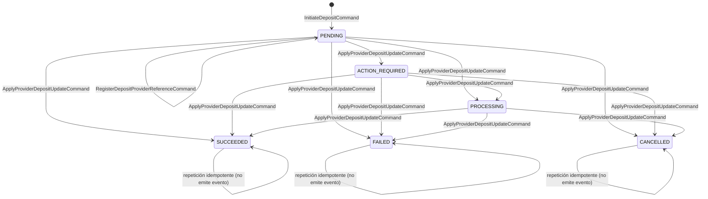

# Contratos iniciales de Finance

- **Estado:** Propuesto para revisión conjunta
- **Versión:** 1.1-inicial
- **Fecha:** 2026-07-26
- **Bounded Context:** Finance
- **Servicio:** `vankoo-finance-service`
- **ADR relacionados:** [ADR-0001](../adr/0001-axon-server-event-store-postgresql-read-model.md) · [ADR-0002](../adr/0002-axon-version-and-server-licensing.md)

## Propósito

Este documento define los contratos iniciales del bounded context Finance antes
de implementar clases, controladores o configuraciones de infraestructura.

El contrato se divide en:

- alcance de negocio y modelo de dominio;
- comandos y eventos de dominio;
- eventos públicos de integración hacia Kafka;
- puerto de aplicación para proveedores de pago;
- consultas, Read Model y tablas operativas;
- reglas de versionado, idempotencia y consistencia.

El dominio no dependerá de Kafka, PostgreSQL, Redis, HTTP ni del SDK de Stripe.
Esos detalles se conectarán desde `application`, `infrastructure` e `interfaces`.
La dependencia de Axon Framework en el dominio se limita a anotaciones de
modelado, según lo justificado en el [ADR-0002](../adr/0002-axon-version-and-server-licensing.md).

---

## Alcance de negocio de la v1

Vankoo es una plataforma de crowdfactoring. El dinero se mueve en cuatro
momentos distintos:

| Movimiento | Dirección | ¿En la v1? |
|---|---|---|
| Recarga de saldo del inversionista | entrante | **Sí** |
| Desembolso a la MYPE | saliente | No |
| Cobranza al deudor de la factura | entrante | No |
| Payout al inversionista | saliente | No |

**La v1 de Finance modela únicamente la recarga de saldo del inversionista.**
El inversionista no paga una factura concreta en el momento: acredita fondos en
su monedero y luego decide en qué operaciones los usa.

Por eso el agregado se llama `Deposit` y no `Payment`. La palabra «pago» queda
reservada para los movimientos salientes, que tendrán su propio contrato y muy
probablemente su propio agregado (payouts y desembolsos usan APIs distintas del
proveedor y tienen un ciclo de vida distinto).

### Frontera explícita con el saldo

```text
Deposit  ──►  ...  ──►  DepositSucceededEvent      ← aquí termina la v1
                                │  (event bus interno de Axon)
                                ▼
                     Wallet / Ledger  (segundo agregado, contrato siguiente)
```

`Deposit` **no acredita saldo**. Solo registra que entró dinero y que el
proveedor lo confirmó.

El saldo es una invariante de negocio: «no puedes invertir más de lo que
tienes». Una invariante no puede validarse contra una proyección, y el saldo
además lo mueven las inversiones y los retiros, no solo las recargas. Por tanto
el saldo debe vivir en su propio agregado event-sourced (`Wallet` o `Ledger`).

**`Wallet` será un segundo agregado dentro del bounded context Finance**, no otro
microservicio. Vankoo sigue la regla «1 microservicio = 1 bounded context», y
saldo y recargas comparten la misma invariante contable: separarlos obligaría a
coordinar dos servicios para acreditar una recarga, con consistencia eventual en
algo que queremos transaccional.

Consecuencia directa: `DepositSucceededEvent` llegará a `Wallet` por el **event
bus interno de Axon**, no por Kafka. Kafka sigue reservado para cruzar la
frontera del bounded context hacia otros servicios de Vankoo.

> **Consecuencia asumida:** en la v1, una recarga exitosa **no deja saldo
> utilizable** para el inversionista. Es una rebanada vertical completa y
> demostrable (comando → invariantes → evento → event store → replay →
> proyección → query), pero no es un flujo de producto cerrado. El agregado
> `Wallet` es el siguiente contrato, no una tarea opcional.

Finance **no** definirá todavía balances contables. La restricción evita que una
proyección de recargas se convierta en una fuente contable implícita.

---

## Convenciones transversales

### Identificadores

**Todos los identificadores son value objects, nunca `String` desnudos.** Es el
patrón de *Business Key Identifier* de la guía (`BookingId` como `@Embeddable`):
el tipo impide confundir un `accountId` con un `depositId` en una firma de método.

**Identificadores propios de Finance — UUID versión 7:**

| VO | Envuelve | Propósito |
|---|---|---|
| `DepositId` | UUIDv7 | Identidad de la recarga. Lo genera Finance antes de enviar el comando de creación. |
| `AccountId` | UUIDv7 | El **monedero del inversionista** que recibirá los fondos. No es un usuario, un JWT ni un identificador del proveedor. |

UUIDv7 en lugar de v4 porque lleva un prefijo temporal y es **ordenable por
tiempo de creación**. Eso da localidad de inserción en los índices B-tree de
`deposit_view` y de las tablas de `finance_ops` —los `INSERT` caen al final del
índice en vez de dispersos, como con v4— y permite ordenar por identificador sin
consultar `created_at`. Se conserva la generación en cliente sin coordinación.

Reglas:

- Se almacenan en PostgreSQL como tipo nativo `uuid`, no como `text`. El
  beneficio de localidad depende del orden de bytes nativo; guardarlos como texto
  lo pierde.
- **UUIDv7 expone la marca de tiempo de creación.** Es aceptable para
  `depositId` y `accountId`, que no son secretos. No se usará UUIDv7 para nada
  que deba ser impredecible o que no deba revelar cuándo se creó.
- La versión del UUID es una decisión de generación, no del contrato de
  transporte: en JSON y en los tags de Axon viajan como string canónico.

**Identificadores ajenos — opacos, nunca UUID:**

| VO | Origen | Regla |
|---|---|---|
| `ProviderDepositId` | asignado por el proveedor | opaco, se almacena tal cual, no se parsea ni valida su forma |
| `ProviderEventId` | evento externo del proveedor | opaco, se usa para deduplicar webhooks |
| `IdempotencyKey` | enviado por el cliente | opaco, no imponemos formato |

Envolverlos en VOs también, pero **sin asumir que son UUID**. Stripe no promete
ningún formato, y validar su forma nos rompería si lo cambia.

> Pendiente: elegir la librería de generación de UUIDv7. El JDK solo genera v4
> (`UUID.randomUUID()`), así que hace falta una dependencia. Se decide en el
> bootstrap (Tarjeta 2).

### Dinero

En el dominio, el dinero es un **value object `Money`** con dos campos:

```java
Money(long amountMinor, Currency currency)
```

Reglas:

- `amountMinor` es una cantidad entera en unidades menores y debe ser mayor que cero;
- no se utilizarán `float` ni `double` para dinero;
- `currency` es ISO 4217 en mayúsculas y debe pertenecer al catálogo soportado;
- una recarga no cambia de moneda después de creada;
- **no se permiten operaciones aritméticas entre `Money` de distinta moneda.** Sumar
  PEN con USD debe fallar en tiempo de ejecución, no convertir en silencio.

**Catálogo soportado en la v1: `PEN` y `USD`.** Se modela como enum en el dominio,
de forma que la invariante 2 se comprueba en compilación y no puede colarse una
moneda sin soporte operativo.

> Soportar dos monedas desde la v1 arrastra dos preguntas al diseño de `Wallet`,
> que quedan abiertas: si el inversionista tiene **un monedero por moneda o uno
> con un saldo por moneda**, y si una recarga en USD puede financiar una factura
> en PEN —lo que introduciría tipo de cambio, que es un tema propio con su
> política de redondeo y su fuente de tasas. Ninguna bloquea la v1 de `Deposit`,
> pero conviene no descubrirlas al empezar `Wallet`.

**En el JSON de eventos y contratos externos, `Money` se serializa aplanado**
como `amountMinor` + `currency`. Se documenta aquí de forma explícita para que
nadie modele dos conceptos distintos: es un único VO con una representación
plana en el borde.

### Fechas y texto

- Las fechas se representan como ISO-8601 en UTC.
- Los textos de dominio deben tener límites definidos por el caso de uso.
- No se almacenarán números de tarjeta, CVV, secretos ni payloads crudos de
  Stripe dentro de eventos de dominio.

---

## Agregado `Deposit`

### Estados



`RegisterDepositProviderReferenceCommand` **no cambia el estado**: aparece como
auto-transición en `PENDING` para dejar claro que existe y que ocurre en
paralelo al ciclo de vida, no dentro de él.

Los estados `SUCCEEDED`, `FAILED` y `CANCELLED` son terminales para la primera
versión. Una modificación posterior, como un reembolso, debe tener un contrato
propio y no reabrir la recarga original.

### Comandos

Los comandos representan intenciones. No son hechos históricos y no se
persisten como eventos.

| Comando | Propósito | Campos obligatorios | Emisor esperado |
|---|---|---|---|
| `InitiateDepositCommand` | Crear una recarga en estado `PENDING`. | `depositId`, `accountId`, `amount`, `provider`, `idempotencyKey`, `requestedAt` | API de Finance |
| `RegisterDepositProviderReferenceCommand` | Asociar a la recarga la referencia creada por el proveedor. | `depositId`, `provider`, `providerDepositId`, `registeredAt` | Caso de uso de recargas |
| `ApplyProviderDepositUpdateCommand` | Aplicar un estado normalizado observado desde un webhook o una consulta al proveedor. | `depositId`, `provider`, `providerDepositId`, `providerEventId`, `status`, `observedAt` | Adaptador de proveedor |

Campos opcionales:

- `description` en `InitiateDepositCommand`;
- `actionUrl` en `RegisterDepositProviderReferenceCommand` cuando el usuario
  deba completar una acción;
- `failureReason` en `ApplyProviderDepositUpdateCommand` cuando el estado sea
  `FAILED`;
- `cancellationReason` cuando el estado sea `CANCELLED`.

El `routingKey` de los comandos dirigidos a una recarga es `depositId`.

### Eventos de dominio

Los eventos representan hechos que ya ocurrieron y forman parte del historial
del agregado en el Event Store.

| Evento | Cuándo se produce | Alcance inicial |
|---|---|---|
| `DepositInitiatedEvent` | Se acepta la creación de la recarga. | Interno |
| `DepositProviderReferenceRegisteredEvent` | Se registra la referencia del proveedor. | Interno |
| `DepositActionRequiredEvent` | El proveedor requiere una acción del usuario. | Público potencial |
| `DepositProcessingStartedEvent` | El proveedor informa que la recarga entró en procesamiento. | Público potencial |
| `DepositSucceededEvent` | La recarga queda confirmada. | Público |
| `DepositFailedEvent` | La recarga queda rechazada o fallida. | Público |
| `DepositCancelledEvent` | La recarga queda cancelada. | Público |

Los nombres expresan lenguaje de negocio en **pasado** —son hechos consumados—
y no contienen `Axon`, `Kafka`, `Stripe`, `Postgres` ni nombres de clases de
infraestructura.

### Datos de los eventos

`DepositInitiatedEvent`:

```json
{
  "depositId": "2b7f1f7d-9f67-4a46-9db8-f44ca7e43d0a",
  "accountId": "8b8c7f7e-f91d-4c13-9f18-1f0e9c8b3d21",
  "amountMinor": 12500,
  "currency": "PEN",
  "provider": "STRIPE",
  "idempotencyKey": "opaque-client-key",
  "description": "Recarga de saldo"
}
```

`idempotencyKey` y `description` se registran aquí y **solo aquí**. La clave da
trazabilidad desde la recarga hasta la petición original del cliente, útil cuando
alguien reclama un cobro duplicado; la descripción es texto del inversionista que
se muestra en su historial. Ninguno de los dos participa en decisiones del
agregado: son datos que el evento conserva, no estado que gobierne transiciones.

`DepositProviderReferenceRegisteredEvent` añade los datos técnicos necesarios
para continuar la integración, y por eso **no se publica**:

```json
{
  "depositId": "2b7f1f7d-9f67-4a46-9db8-f44ca7e43d0a",
  "provider": "STRIPE",
  "providerDepositId": "opaque-provider-reference",
  "actionUrl": "https://provider.example/action/opaque-reference"
}
```

`DepositSucceededEvent` — el hecho que consumirá el futuro `Wallet`:

```json
{
  "depositId": "2b7f1f7d-9f67-4a46-9db8-f44ca7e43d0a",
  "accountId": "8b8c7f7e-f91d-4c13-9f18-1f0e9c8b3d21",
  "amountMinor": 12500,
  "currency": "PEN",
  "provider": "STRIPE"
}
```

`DepositFailedEvent` añade una razón normalizada de Finance:

```json
{
  "depositId": "2b7f1f7d-9f67-4a46-9db8-f44ca7e43d0a",
  "accountId": "8b8c7f7e-f91d-4c13-9f18-1f0e9c8b3d21",
  "amountMinor": 12500,
  "currency": "PEN",
  "provider": "STRIPE",
  "failureReason": "DECLINED"
}
```

Las razones de fallo iniciales son `DECLINED`, `EXPIRED`,
`INVALID_PAYMENT_METHOD`, `PROVIDER_ERROR` y `UNKNOWN`. Los códigos internos de
Stripe no forman parte del contrato de dominio.

---

## Invariantes del agregado

1. Una recarga debe tener `depositId`, `accountId`, importe, moneda y proveedor.
2. El importe debe ser positivo y la moneda debe pertenecer al catálogo soportado.
3. La identidad, el importe, la moneda y la cuenta no pueden cambiar después de
   `DepositInitiatedEvent`.
4. Solo puede registrarse una referencia de proveedor. Repetir exactamente la
   misma referencia es idempotente; intentar registrar otra distinta es un
   conflicto.
5. Una actualización del proveedor debe coincidir con el `provider` y el
   `providerDepositId` registrados **si ya existe un registro**. Si aún no
   existe, se aplica la regla 6.
6. **Actualización anticipada:** si llega una actualización válida antes de que
   se haya registrado la referencia del proveedor, el agregado **no** la aplica
   ni la rechaza definitivamente. El adaptador la aparca y la reintenta (ver
   *Webhooks: inbox, deduplicación y reintentos*). Esto evita depender del orden
   de llegada entre nuestra propia escritura y la del proveedor.
7. Una transición desde un estado terminal no produce ningún evento nuevo. Se
   trata como éxito idempotente, no como error.
8. Un evento externo no modifica directamente una tabla ni un saldo: primero se
   traduce a un comando y el agregado decide qué evento de dominio producir.
9. El agregado no consulta el Read Model, las tablas operativas, Redis, Stripe
   ni Kafka para validar invariantes.

> **Nota sobre deduplicación.** La versión anterior de este contrato exigía que
> el agregado recordase todos los `providerEventId` procesados. Se retira: esa
> lista crece sin cota y encarece cada rehidratación. La deduplicación vive en
> el inbox de webhooks (barrera operativa) y la invariante 7 la respalda dentro
> del dominio (barrera de corrección). Ver la sección de webhooks.

---

## Mapeo de proveedores externos

Stripe y otros proveedores se consideran entradas externas. El adaptador debe
traducir sus estados a la taxonomía de Finance antes de enviar el comando:

| Situación externa normalizada | Estado de Finance |
|---|---|
| Requiere acción del usuario | `ACTION_REQUIRED` |
| En procesamiento | `PROCESSING` |
| Confirmado | `SUCCEEDED` |
| Rechazado o con error definitivo | `FAILED` |
| Cancelado o expirado | `CANCELLED` |

Esta taxonomía está implementada como el enum `NormalizedDepositStatus`, en
`domain/model/valueobjects`. No incluye
`PENDING` porque ese es el estado inicial que el agregado se da a sí mismo al
aceptar la recarga, y nunca llega desde una observación externa.

El dominio no recibirá un objeto `Stripe.Event`, `PaymentIntent` ni otro tipo
del SDK. La verificación de firma y la retención temporal del payload crudo
pertenecen a `infrastructure`.

## Contrato del puerto `PaymentProvider`

El puerto vive en `application` y **habla exclusivamente en tipos de dominio**:

| Operación | Entrada | Salida | Responsabilidad |
|---|---|---|---|
| `createDeposit` | `IdempotencyKey`, `DepositId`, `Money`, `description` | `ProviderDepositCreated` | Crear el recurso de cobro externo. |
| `getDeposit` | `Provider`, `ProviderDepositId` | `ProviderDepositStatus` | Consultar el estado externo. |
| `verifyWebhook` | Payload crudo + firma | `VerifiedProviderDepositUpdate` | Verificar autenticidad y normalizar el evento. |

**`PaymentProvider.java` contiene solo esas tres firmas** (Tarjeta 7). No declara
records de petición: las entradas viajan como parámetros sueltos, porque agrupar
`IdempotencyKey` + `DepositId` + `Money` en un `CreateProviderDepositRequest` solo
añadía un tipo que no significaba nada fuera de esa llamada. Los tres tipos de
retorno —`ProviderDepositCreated`, `ProviderDepositStatus`,
`VerifiedProviderDepositUpdate`— sí existen, porque un método tiene que devolver
algo, y viven en `domain/model/valueobjects`.

El puerto no expone tipos de Stripe. La implementación Stripe vive en
`infrastructure` y traduce los errores del SDK a la jerarquía de abajo.

### Errores del puerto

La jerarquía es `sealed` y vive en **`domain/exceptions`**, junto al resto de
excepciones del bounded context. El adaptador traduce a estos tipos cualquier
error del SDK, de modo que ni `application` ni `domain` ven jamás una excepción
de Stripe:

| Error | ¿Reintentable? | Situación |
|---|---|---|
| `PaymentProviderTimeoutException` | Sí | El proveedor no respondió dentro del timeout. |
| `PaymentProviderUnavailableException` | Sí | Proveedor caído o error de servidor. |
| `PaymentProviderRejectedException` | No | Petición inválida, credenciales o regla del proveedor. |
| `InvalidWebhookSignatureException` | No | La firma no valida contra el secreto. |
| `UnsupportedProviderEventException` | No | El evento es auténtico, pero de un tipo que el adaptador no normaliza. |

`UnsupportedProviderEventException` se separó de `PaymentProviderRejectedException`
en la Tarjeta 7 porque el endpoint de webhooks necesita distinguirlas: un cuerpo
corrupto es un `400`, mientras que un tipo al que estamos suscritos de más se
acusa con `200`. Responder con error a lo segundo solo consigue que el proveedor
reintente indefinidamente un evento que nunca vamos a aplicar; la corrección está
en la suscripción del dashboard, no en la respuesta HTTP.

Un cobro rechazado **no** es una excepción: es un desenlace de negocio y viaja
como `FAILED` dentro de `ProviderDepositStatus`. La distinción importa porque un
rechazo debe producir `DepositFailedEvent`, mientras que un error del puerto no
produce ningún evento de dominio.

### Estrategia de timeout y retry

El puerto no implementa timeout ni retry: eso pertenece al adaptador concreto
(Tarjeta 6), que es quien conoce el transporte. Lo que el puerto sí garantiza es
**señalar** qué fallos son transitorios, mediante la interfaz marcadora
`RetryablePaymentProviderException`. Quien orquesta el caso de uso decide si
reintenta, con qué backoff y cuántas veces, sin inspeccionar mensajes de error
por texto ni acoplarse a tipos concretos.

Regla asociada: **un reintento debe conservar la misma `IdempotencyKey`.** Un
timeout no prueba que la operación no se haya ejecutado del otro lado, así que
reintentar con una clave nueva podría duplicar el cobro.

Valores iniciales, a confirmar en la Tarjeta 6 contra la latencia real de Stripe:

| Parámetro | Valor inicial |
|---|---|
| Timeout de conexión | 5 s |
| Timeout de lectura | 10 s |
| Intentos máximos | 3 (1 original + 2 reintentos) |
| Backoff | exponencial: 200 ms, 400 ms, con jitter aleatorio |

Qué se puede reintentar:

- `getDeposit` siempre: es una lectura idempotente por naturaleza y es además
  el camino de reconciliación cuando un webhook se pierde.
- `createDeposit` solo conservando la misma `IdempotencyKey`.
- `verifyWebhook` nunca: no sale a la red, y sus dos fallos posibles —firma
  inválida o payload corrupto— son definitivos.

Agotados los intentos, el error se propaga: el puerto no traga fallos en
silencio. Quien orquesta decide si aparca la operación o la marca para revisión.

### Idempotencia en `createDeposit`

El parámetro `idempotencyKey` de `createDeposit` es obligatorio. La implementación
Stripe lo mapea al header `Idempotency-Key` de la API de Stripe.

Es una barrera distinta de la de `finance_ops.deposit_command_idempotency`: esa
evita que el **cliente** cree dos recargas; esta evita que **Finance** cree dos
recursos de cobro en el proveedor al reintentar.

### Representación del dinero en el puerto

El puerto usa `amountMinor` + `currency` aplanados, no un value object `Money`,
porque `Money` es del dominio y todavía no existe. Es la misma representación
plana que el contrato ya fija para el JSON de eventos y para Kafka, así que no
introduce un concepto nuevo. Al llegar `Money`, el puerto puede adoptarlo sin
cambiar su semántica.

El puerto valida solo la **forma** ISO 4217 (tres letras). Que la moneda
pertenezca al catálogo soportado es una invariante de negocio y la comprueba el
agregado antes de que se invoque el puerto: repetirla aquí duplicaría una regla
que no pertenece a esta capa.

---

## Webhooks: inbox, deduplicación y reintentos

Todo webhook entrante pasa por una **tabla inbox** antes de convertirse en
comando. Un único componente resuelve tres problemas: deduplicación, llegada
anticipada y reintentos.

```text
finance_ops.provider_webhook_inboxes
  UNIQUE(provider, provider_event_id)     -- deduplicación
  payload_ref                             -- SHA-256 del payload crudo
  status        RECEIVED | APPLIED | PARKED | DISCARDED
  normalized_status, failure_reason, cancellation_reason, observed_at
  attempts, next_attempt_at, last_error
  deposit_id                              -- resuelto, si se conoce
```

> **Los nombres de tabla van en plural** (`provider_webhook_inboxes`,
> `deposit_provider_references`). La prosa de este contrato los nombra en
> singular, pero la naming strategy del proyecto pluraliza el nombre derivado de
> la `@Entity` y `ddl-auto=validate` compara contra eso. La migración `V2` sigue
> lo que Hibernate genera, igual que hizo `V1` con las tablas de Axon.

**`payload_ref` es un hash, no una referencia a un payload guardado** (decidido en
la Tarjeta 7). No retenemos el cuerpo crudo: los campos normalizados de la fila son
todo lo que un reintento necesita, y el hash basta para correlacionar la fila con
una entrega concreta en el dashboard de Stripe. Con eso desaparece la pregunta de
retención abierta en «Decisiones pendientes»: no hay nada del proveedor que purgar.

Flujo:

1. `interfaces` recibe el HTTP y conserva el payload crudo y la firma.
2. `infrastructure` verifica la firma **antes** de interpretar el payload.
3. Se intenta insertar en el inbox. Si `(provider, provider_event_id)` ya
   existe, es un duplicado: se responde `200` y **no** se emite comando.
4. Se resuelve el `depositId` a partir del `providerDepositId`.
   - Si se resuelve, se emite `ApplyProviderDepositUpdateCommand` y la fila
     pasa a `APPLIED`.
   - Si no se resuelve todavía (la referencia aún no se ha registrado), la fila
     pasa a `PARKED` con `next_attempt_at` y se reintenta con backoff
     exponencial.
5. Agotados los reintentos, la fila queda `PARKED` para revisión manual y
   dispara una alerta. Nunca se crea una recarga desde un webhook.

Reglas:

- Un webhook repetido no produce un nuevo evento de negocio.
- Un webhook válido para una recarga inexistente no crea la recarga.
- El `providerEventId` es obligatorio.
- La respuesta HTTP al proveedor no espera al procesamiento del comando.

**Triple barrera:** la restricción única del inbox evita el trabajo repetido, el
camino `PARKED` + reintento resuelve el orden de llegada, y la invariante 7
garantiza la corrección aunque un duplicado se cuele (un `SUCCEEDED` sobre una
recarga ya `SUCCEEDED` no emite evento).

El flujo completo, con sus ramas de firma inválida, duplicado, llegada
anticipada y estado terminal, está en
[`uml/finance-webhook-sequence-diagram.puml`](../uml/finance-webhook-sequence-diagram.puml).

### Cómo quedó implementado (Tarjeta 7)

| Pieza | Clase |
|---|---|
| Endpoint | `interfaces/rest/webhooks/StripeWebhookController` |
| Verificación de firma | `infrastructure/providers/stripe/StripePaymentProvider.verifyWebhook` |
| Caso de uso (interfaz) | `domain/services/WebhookInboxService` |
| Inbox (implementación) | `application/internal/commandservices/WebhookInboxServiceImpl` |
| Escritura de referencias | `application/internal/eventhandlers/DepositProviderReferenceRegisteredEventHandler` |
| Tablas | `infrastructure/persistence/jpa/{entities,repositories}` + `V2__finance_ops_webhook_inbox.sql` |

Tres detalles del diseño que el código hace explícitos:

- **La deduplicación es una sola sentencia.** `INSERT ... ON CONFLICT (provider,
  provider_event_id) DO NOTHING` devuelve 0 filas cuando el evento ya se había
  visto. Un `exists()` seguido de un `insert` dejaría una ventana en la que dos
  entregas simultáneas del mismo evento insertan las dos.
- **El barrido usa `FOR UPDATE SKIP LOCKED`**, así que puede correr en más de una
  instancia sin elección de líder: una fila que otro nodo ya está trabajando se
  salta, no se espera.
- **Una fila que agota sus intentos deja de ser elegible por `attempts`, pero se
  queda en `PARKED`.** Nunca pasa a `DISCARDED`: un webhook que no pudimos
  resolver no es un webhook que podamos tirar. `DISCARDED` queda reservado para
  lo que el agregado rechaza de forma definitiva (estado terminal o referencia
  que no coincide).

**Desviación que sigue en pie tras la Tarjeta 4:** `DepositCommandService` ya
existe, pero solo declara `handle(InitiateDepositCommand)` — lo que necesita la
capa REST, no lo que necesita el inbox. El inbox sigue despachando
`ApplyProviderDepositUpdateCommand` por el `CommandGateway` de Axon
directamente, con el mismo `TODO` de antes: extender la interfaz para cubrir
ese comando y recablear el inbox es trabajo aparte, deliberadamente fuera de la
Tarjeta 4 para no tocar código del inbox sin necesidad.

**Clasificación de fallos al despachar.** El inbox distingue definitivo de
transitorio recorriendo la cadena de causas en busca de
`TerminalStateTransitionException` o `ProviderReferenceMismatchException`. Como
los comandos viajan por Axon Server, el tipo original puede llegar envuelto; en
ese caso la fila se aparca en vez de descartarse. Reintentar algo sin remedio
cuesta unos intentos y termina delante de un humano, mientras que descartar algo
reintentable pierde en silencio una actualización de recarga.

### Idempotencia de comandos de cliente

```text
finance_ops.deposit_command_idempotencies
  UNIQUE(account_id, idempotency_key)
  stores(deposit_id, request_hash)
```

- `Idempotency-Key` es obligatorio para iniciar una recarga.
- La misma clave con el mismo contenido devuelve el mismo `depositId`.
- La misma clave con contenido distinto produce un conflicto (`409`).

**Implementado en la Tarjeta 4** (`DepositCommandServiceImpl`, en
`application/internal/commandservices`): inserta primero, despacha después —
mismo principio que el inbox de webhooks, pero en el orden inverso, porque acá
lo que hay que evitar es que dos solicitudes concurrentes con la misma clave
despachen `InitiateDepositCommand` dos veces, no perder una entrega. El
`request_hash` es un SHA-256 de los campos significativos de la solicitud
(`accountId`, `amountMinor`, `currency`, `provider`, `description`). El método
va en una única transacción que también envuelve el despacho del comando: si
`InitiateDepositCommand` es rechazado, la fila de idempotencia se revierte con
él, en vez de quedar apuntando para siempre a un `depositId` que nunca llegó a
existir.

### Resolución de referencias del proveedor

```text
finance_ops.deposit_provider_references
  UNIQUE(provider, provider_deposit_id) -> deposit_id
```

La escribe `DepositProviderReferenceRegisteredEventHandler`, un `@EventHandler`
sobre `DepositProviderReferenceRegisteredEvent` con
`@ProcessingGroup("deposit-provider-reference")`. Vive en
`application/internal/eventhandlers`, el paquete de los handlers de eventos
propios que no son la proyección. No va en `queryservices`: ese es el Query
Model de `deposit_view`, y esta tabla no es read model —participa en una decisión
de admisión, que es justo lo que el ADR-0001 prohíbe hacer contra una proyección.
Tampoco es `interfaces/messaging/eventhandlers`, reservado para eventos de otros
bounded contexts.

Este handler y el callback del proveedor son dos escritores sin orden entre
ellos: si pierde, el inbox aparca y reintenta hasta que la fila existe. Es la otra
mitad de la barrera de orden de llegada.

> **Estas tres tablas viven en el schema `finance_ops`, no en
> `finance_read_model`.** No son proyecciones de consulta: son infraestructura
> operativa del borde. La distinción es deliberada, porque el ADR-0001 prohíbe
> usar el Read Model para validar invariantes, y estas tablas sí participan en
> decisiones de admisión. Son reconstruibles a partir del historial de eventos y
> del log de webhooks, y su pérdida degrada las garantías de deduplicación pero
> no corrompe el historial.

---

## Eventos de integración hacia Kafka

### Selección

Se publican **solo los desenlaces**, que son los hechos que otro bounded context
puede necesitar:

- `DepositSucceededEvent`;
- `DepositFailedEvent`;
- `DepositCancelledEvent`.

El resto son internos, cada uno por su motivo:

| Evento | Por qué no se publica |
|---|---|
| `DepositInitiatedEvent` | Que una recarga *empiece* no es un hecho útil fuera: el monedero solo reacciona cuando termina bien, y vive dentro de Finance. Además lleva `idempotencyKey` y `description`, que son plomería nuestra y texto libre del inversionista: nada que deba cruzar la frontera. |
| `DepositProviderReferenceRegisteredEvent` | Expone una referencia del proveedor. |
| `DepositActionRequiredEvent` | Describe un paso intermedio del flujo de pago, no un hecho de negocio cerrado. |
| `DepositProcessingStartedEvent` | Igual: estado transitorio del proveedor. |

> Esta separación se apoya en la regla del ADR-0001 de que **el evento de dominio
> y el de integración comparten el mismo payload**. Como no hay mapper que recorte
> campos, la única forma de no exponer un dato es no publicar el evento que lo
> lleva. Es una restricción real de esa regla, y `DepositInitiatedEvent` es el
> primer caso donde se nota: si algún día necesitamos publicar un hecho cuyo
> evento de dominio contiene algo privado, habrá que revisar la regla en vez de
> forzar el contrato.

> **Kafka en la v1 no tiene consumidor todavía.** El consumidor natural de
> `DepositSucceededEvent` es `Wallet`, y `Wallet` vive **dentro** de Finance, así
> que lo recibirá por el event bus de Axon. Los consumidores externos llegarán
> cuando otros servicios de Vankoo necesiten estos hechos.
>
> Se mantiene la publicación desde la v1 para fijar el contrato antes de que
> exista el primer consumidor, no porque haya uno.
>
> **Consecuencia al implementarlo (Tarjeta 8):** un header equivocado no rompe
> nada hoy. Saldría a producción en silencio y se descubriría meses después, con
> un topic lleno de histórico mal etiquetado detrás. Por eso el peso de la
> tarjeta está en los headers y en sus pruebas, no en el envío.

### Cómo quedó implementado (Tarjeta 8)

| Pieza | Clase |
|---|---|
| Selección y publicación | `application/internal/outboundservices/events/DepositEventPublisher` |
| Ensamblado de key y headers | `.../events/DepositIntegrationEventAssembler` |
| Mensaje del puerto | `.../events/IntegrationEvent` |
| Puerto de salida | `.../events/EventService` |
| Productor Kafka | `infrastructure/brokers/kafka/services/EventServiceImpl` |
| Binding lógico | `finance-out-0`, en los perfiles `dev` y `docker` |
| Processing group | `deposit-integration-events` |

Tres cosas que el código hace explícitas:

- **La selección es la ausencia de métodos.** Solo los tres desenlaces tienen
  `@EventHandler`; los cuatro internos no tienen ninguno. No hay lista ni `if` que
  mantener en sincronía con este catálogo. Añadir uno para
  `DepositInitiatedEvent` expondría `idempotencyKey` y `description` en un topic
  público, así que la regla al revisar un PR es contar los handlers: deben ser
  tres. **Nada lo comprueba automáticamente todavía** — ver más abajo.
- **El publicador tiene grupo propio, separado de `wallet-crediting`.** Si Kafka
  está caído, este token se queda atrás y reintenta mientras el acreditado del
  monedero sigue avanzando. Compartir grupo dejaría que el broker frene el
  negocio, que es lo contrario de lo que vale publicar sin consumidor.
- **`IntegrationEvent` exige los ocho headers obligatorios en su constructor**, en
  el momento de publicar, en vez de dejar que la falta aparezca en casa de un
  consumidor futuro.

**Cuidado con resetear el token de `deposit-integration-events`:** republica todos
los desenlaces desde el principio. Es at-least-once funcionando como debe —y la
razón de que el contrato obligue a deduplicar por `event-id`— pero no es algo que
hacer a la ligera.

**La key del registro necesita configuración.** El binder serializa las keys como
`byte[]` por defecto; el `depositId` es un `String`, así que los perfiles fijan
`key.serializer` al de String. Sin eso la clave de partición sale mal y se pierde
la garantía de orden por recarga.

> **Corregido en la Tarjeta 49:** ese `key.serializer` estaba bajo
> `spring.cloud.stream.bindings.finance-out-0.producer.configuration`, y ahí **no
> se aplicaba**. Ver la sección siguiente.

> **La Tarjeta 8 no trae pruebas automáticas.** Se integran más adelante; no
> estaban en el alcance de esta entrega. Conviene saber qué queda sin red,
> porque en esta pieza el coste de un fallo es diferido: Kafka no tiene
> consumidor, así que nada se rompe hoy y el error aparecería meses después con
> un topic lleno de histórico mal etiquetado detrás. Lo que hay que cubrir cuando
> se retomen, por orden de riesgo:
>
> 1. Que `correlation-id` salga del `traceId` y `causation-id` del
>    `correlationId`. Es lo que un refactor invierte sin que nadie lo note.
> 2. Que `DepositEventPublisher` tenga exactamente tres `@EventHandler`.
> 3. Que el mensaje llegue al binding con la key puesta y los nueve headers
>    intactos. `spring-cloud-stream-test-binder` ya está en el `pom` para eso.
>
> **Estado tras la Tarjeta 49:** el punto 3 queda cubierto a nivel de unidad por
> `EventServiceImplTest`, que captura el mensaje y compara key y headers. Los
> puntos 1 y 2 siguen abiertos: nada comprueba todavía que `correlation-id` salga
> del `traceId` ni que los `@EventHandler` sean exactamente tres.

La regla es: un evento de dominio público y su evento de integración comparten
el mismo payload de negocio. No se publican mensajes técnicos de Axon, clases
serializadas con el nombre completo del paquete ni objetos del SDK de Stripe.

### Detección de fallos de envío (Tarjeta 49)

La Tarjeta 8 publicaba **a ciegas**: `EventServiceImpl` ignoraba el `boolean` de
`streamBridge.send(...)` y el binding no pedía confirmación, así que el binder
enviaba asíncrono. `send()` volvía al entregar el registro al productor, no al
recibir el ack del broker, y el rechazo posterior —timeout, `acks=all` sin
réplicas suficientes, broker caído— acababa en el `failureChannel` de
`KafkaProducerMessageHandler`, que con `errorChannelEnabled: false` (el valor por
defecto) es `null`. El `@EventHandler` terminaba limpio, Axon avanzaba el token
de `deposit-integration-events` y el desenlace se perdía: exactamente lo
contrario de lo que promete `EventService`.

**Publicación síncrona, a propósito.** El binding fija `producer.sync: true`, así
que el binder espera el ack o lanza. `EventServiceImpl` además comprueba el
`boolean` —un canal puede rechazar el mensaje sin lanzar— y traduce ambos casos a
`IntegrationEventPublicationException`, con la key y el `event-id` en el mensaje.
`DepositEventPublisher` no captura nada.

**Lanzar no bastaba.** El `ListenerInvocationErrorHandler` por defecto de Axon es
`LoggingErrorHandler`: atrapa lo que lance el handler, escribe «failed to handle
event … Continuing processing with next listener» y devuelve normalmente. El
procesador ve un lote correcto y avanza el token igual. Medido contra un broker
real: el token pasó de 12 a 15 con el evento sin publicar. Por eso
`IntegrationEventProcessorConfiguration` registra un `PropagatingErrorHandler`
**solo** para este grupo, y con él el token sí se queda quieto.

> **Latente en los otros grupos.** `DepositChargeCreator` y `WalletCreditor`
> relanzan fallos transitorios documentando que el procesador «deja el token donde
> estaba». Con el handler por defecto eso hoy **no es cierto** en ninguno de los
> dos. No se toca aquí porque decidir qué hace un fallo permanente con *sus* colas
> es de sus tarjetas, pero queda anotado.

**Los timeouts del productor tienen que caber bajo el de Axon.** Axon interrumpe
un handler que pase de `axon.timeout.handler.events.timeout-ms` (30 s por
defecto). Dos esperas del productor se suman dentro de `publishEvent` y las dos
venían de fábrica por encima de ese presupuesto:

| Propiedad | Fábrica | Aquí | Qué acota |
|---|---:|---:|---|
| `max.block.ms` | 60 s | 5 s | espera de metadata **dentro** de `send()` |
| `delivery.timeout.ms` | 120 s | 15 s | de ahí sale el `sendTimeout` del envío síncrono |
| `request.timeout.ms` | 30 s | 7 s | por la regla `delivery >= request + linger` |

Con los valores de fábrica el janitor de Axon interrumpía el hilo a los 30 s y el
fallo llegaba como `AxonTimeoutException`, no como el nuestro. Peor caso ahora
~20,5 s, con margen. Fallar rápido además es lo que se quiere: reintentar es
trabajo de Axon, no del productor.

**Las propiedades del productor van bajo `spring.cloud.stream.kafka`, no bajo
`spring.cloud.stream`.** Es el error que esta tarjeta destapó y merece quedar
escrito, porque no avisa de nada:

| Propiedad | Dónde va | Dónde estaba |
|---|---|---|
| `destination`, `content-type` | `spring.cloud.stream.bindings.finance-out-0` | igual |
| `sync`, `configuration.key.serializer` | `spring.cloud.stream.kafka.bindings.finance-out-0.producer` | `spring.cloud.stream.bindings.finance-out-0.producer` |

`spring.cloud.stream.bindings.<name>.producer` enlaza contra el
`ProducerProperties` del núcleo, que no tiene `sync` ni `configuration`; los dos
son de `KafkaProducerProperties`, anotada
`@ConfigurationProperties("spring.cloud.stream.kafka")`. Lo que cae en el
namespace equivocado **se ignora en silencio** —`BindingHandlerAdvise` solo mapea
hacia `spring.cloud.stream.default`, nunca al del binder—, así que el
`key.serializer` de String nunca llegó a aplicarse.

> **La consecuencia era peor que una key mal particionada.** Verificado contra un
> broker real con la configuración anterior: `key.serializer` valía
> `ByteArraySerializer` y el envío moría en
> `SerializationException: Can't convert key of class java.lang.String`. Es decir,
> **nunca salió un solo desenlace al topic**. No se notó porque Kafka no tiene
> consumidor y porque no había pruebas de integración.

**El grupo propio es lo que hace tolerable el bloqueo.** Mientras Kafka esté
caído, este token se queda atrás reintentando; `wallet-crediting` sigue
acreditando. Medido durante una caída provocada: `deposit-integration-events` se
quedó en 18 y `wallet-crediting` llegó a 21. Al volver el broker, el desenlace
pendiente se publicó solo en el siguiente reintento, sin reiniciar el servicio.

**Reintento indefinido, sin dead-letter.** Todo fallo de publicación se trata como
transitorio; no existe la rama permanente que `DepositChargeCreator` sí tiene. Es
lo correcto mientras no haya DLT, y es la razón de que el dead-letter siga en
«Decisiones pendientes».

**Piezas nuevas:**

| Pieza | Clase / archivo |
|---|---|
| Excepción del puerto | `domain/exceptions/IntegrationEventPublicationException` |
| Propagación del fallo al token | `infrastructure/configuration/IntegrationEventProcessorConfiguration` |
| `sync`, `key.serializer`, timeouts | `application-dev.yaml`, `application-docker.yaml` |
| Broker real para las pruebas | `testcontainers-junit-jupiter` y `testcontainers-kafka` en el `pom`, versión gestionada por Spring Boot |

**Pruebas:**

| Prueba | Qué fija | Infra |
|---|---|---|
| `EventServiceImplTest` | envío confirmado, canal que rechaza, broker que falla, key y headers intactos | ninguna (`StreamBridge` mockeado) |
| `DepositEventPublisherTest` | la excepción escapa de los tres `@EventHandler` | ninguna (`EventService` mockeado) |
| `KafkaOutageIntegrationTest` | **el criterio de aceptación**: broker real que deja de responder a mitad de vuelo | Docker (Testcontainers) |

**`KafkaOutageIntegrationTest` corre contra la configuración real** del perfil
`dev` (`@ActiveProfiles("dev")`), sobrescribiendo únicamente la dirección del
broker. Es deliberado: lo que se rompió aquí fue configuración —el `sync`, el
namespace donde vive y los timeouts del productor—, así que un test que declarase
su propio binding pasaría mientras producción seguía rota. Verificado como control
negativo: con `sync: false` y **nada más** cambiado, el test falla con «returning
normally is the silent loss».

Dos decisiones suyas que conviene no deshacer:

- **El broker muere a mitad de vuelo, no está caído desde el principio.** Un
  broker que nunca estuvo es otro fallo: el productor no consigue metadata y
  `send()` lanza por `max.block.ms`, cosa que el código viejo también habría
  visto. La pérdida silenciosa necesita un productor que ya tiene metadata,
  acepta el registro en su buffer y falla después. Por eso publica una vez bien
  antes de quitar el broker.
- **Pausa el contenedor, no lo para.** Pausar congela el broker conservando el
  puerto publicado, que es lo que permite probar también la recuperación; un
  contenedor parado volvería en otro puerto. Además modela la caída más honesta:
  un broker que sigue ahí y ya no contesta.

Levanta solo Kafka. Que el token de Axon aguante es comportamiento del procesador,
no del puerto, y sigue cubierto por el procedimiento manual de abajo — automatizarlo
costaría Postgres y Axon Server en el mismo test.

**Cómo reproducir la caída a mano.** Cubre la mitad que el test no llega a ver: el
token. Con `finance-db-postgres`, `axon-server` y `kafka-broker` arriba:

1. Publicar un desenlace con el broker vivo, **para que el productor tenga
   metadata**. Sin este paso el broker está caído desde el principio, `send()`
   muere buscando metadata y no se reproduce el escenario real.
2. `docker stop kafka-broker`.
3. Publicar otro desenlace. En el log: `IntegrationEventPublicationException`, y
   **no** aparece `Published integration event`.
4. Comprobar que el token no se movió:
   `select processor_name, convert_from(lo_get(token),'UTF8') from token_entries` —
   la tabla se llama `token_entries`, en plural, por la estrategia de nombres.
5. `docker start kafka-broker`. El evento sale solo en el siguiente reintento.
6. Contar en el topic: el desenlace está, y at-least-once permite que esté más de
   una vez. Lo que no puede es faltar.

### Topic y clave

- **Topic inicial:** `vankoo.finance.events.v1`
- **Key del registro:** `depositId`
- **Formato:** JSON
- **Entrega:** al menos una vez
- **Orden:** garantizado por Kafka para registros con la misma key, sujeto a la
  configuración de particiones

### Headers de Kafka

Los metadatos técnicos viajan en headers, no dentro del objeto de dominio:

| Header | Obligatorio | Descripción |
|---|---:|---|
| `event-type` | Sí | Nombre del evento, por ejemplo `DepositSucceededEvent`. |
| `event-version` | Sí | Versión del esquema, inicialmente `1`. |
| `event-id` | Sí | Identificador único del evento para deduplicación. |
| `aggregate-type` | Sí | Inicialmente `Deposit`. |
| `aggregate-id` | Sí | Igual a `depositId`. |
| `occurred-at` | Sí | Fecha UTC en formato ISO-8601. |
| `correlation-id` | Sí | Identifica la operación de negocio completa. |
| `causation-id` | No | Identifica el mensaje que causó este evento. |
| `content-type` | Sí | `application/json`. |

El `event-id` debe conservarse durante los reintentos del productor. Los
consumidores deben deduplicar por `event-id` o por una clave de negocio
equivalente.

> **Spring añade dos headers que no son del contrato.** Visto en el topic real:
> `contentType` (camelCase, duplicando `content-type`) y
> `spring_json_header_types`, un JSON con los tipos Java de cada header. Ninguno
> rompe nada, pero filtran plomería de Spring a un contrato público y un consumidor
> externo los verá. Sin decidir todavía si se suprimen.

#### De dónde sale cada header (Tarjeta 8)

Todos los arma `DepositIntegrationEventAssembler`, en
`application/internal/outboundservices/events`:

| Header | Fuente |
|---|---|
| `event-type` | nombre simple de la clase del payload |
| `event-version` | constante `1` |
| `event-id` | `EventMessage.getIdentifier()`, del event store |
| `aggregate-type` | constante `Deposit` |
| `aggregate-id` | `depositId` del payload, igual que la key |
| `occurred-at` | `EventMessage.getTimestamp()` en ISO-8601 |
| `correlation-id` | metadata de Axon: **`traceId`** |
| `causation-id` | metadata de Axon: **`correlationId`** |
| `content-type` | constante `application/json` |

**Los dos de correlación están cruzados, y es correcto.** Axon llama
`correlationId` al mensaje que causó este, y `traceId` al que inició toda la
cadena. Este contrato define `correlation-id` como «la operación de negocio
completa» —o sea, el `traceId` de Axon— y `causation-id` como «el mensaje que
causó este evento» —el `correlationId` de Axon—. Traducirlos por nombre los
intercambia. Los pone Axon solo, vía `MessageOriginProvider`, activo por defecto.

Cuando no hay `traceId` —un evento sin nada aguas arriba— `correlation-id` cae
al identificador del propio evento: un evento sin cadena previa es el inicio de
la suya. El header es obligatorio, y fallar ahí detendría el token del procesador
y con él la publicación de todo lo que venga detrás.

`event-id` sale del event store y no se genera al publicar: por eso se conserva
entre reintentos del productor, que es lo que hace posible la deduplicación en
el consumidor.

#### Sobre el ítem «mappers de Domain Event a Integration Event»

No hay mapper de payload, y no debe haberlo: el ADR-0001 fija que ambos
comparten el mismo payload de negocio. El mapeo que sí existe es **evento de
dominio → mensaje Kafka**: construye key y headers alrededor del payload y lo
deja intacto. Un mapper que recortara campos dejaría además sin sentido el motivo
por el que `DepositInitiatedEvent` no se publica.

### Ejemplo de registro Kafka

Headers:

```text
event-type: DepositSucceededEvent
event-version: 1
event-id: 1b8ed1ab-3ab9-4f8e-ae2e-9e158a3de8de
aggregate-type: Deposit
aggregate-id: 2b7f1f7d-9f67-4a46-9db8-f44ca7e43d0a
occurred-at: 2026-07-26T15:30:00Z
correlation-id: 9fd7498c-8125-4a2c-88d4-ccbfecfd1a1a
content-type: application/json
```

Payload:

```json
{
  "depositId": "2b7f1f7d-9f67-4a46-9db8-f44ca7e43d0a",
  "accountId": "8b8c7f7e-f91d-4c13-9f18-1f0e9c8b3d21",
  "amountMinor": 12500,
  "currency": "PEN",
  "provider": "STRIPE"
}
```

### Compatibilidad y versionado

- Los eventos del Event Store y los contratos Kafka se versionan de forma explícita.
- En la versión `1`, los consumidores deben tolerar campos nuevos que no utilicen.
- Eliminar o renombrar un campo obligatorio requiere una nueva versión mayor.
- No se cambia silenciosamente el significado de un evento existente.
- Migrar eventos históricos requerirá upcasters o una estrategia equivalente
  antes de modificar el agregado.

---

## Read Model y consultas

El Read Model de PostgreSQL es una proyección, no una segunda fuente de verdad.
La primera proyección es `finance_read_model.deposit_views` (nombre en plural:
la naming strategy del proyecto —
`SnakeCaseWithPluralizedTablePhysicalNamingStrategy` — pluraliza todo nombre de
tabla sin excepción, igual que ya le pasó a las tablas de `finance_ops`):

| Campo | Propósito |
|---|---|
| `deposit_id` | Identificador de la recarga. |
| `account_id` | Monedero asociado. |
| `amount_minor` | Importe en unidades menores. |
| `currency` | Moneda ISO 4217. |
| `provider` | Proveedor normalizado. |
| `provider_deposit_id` | Referencia externa, si existe. |
| `description` | Texto del inversionista, para su historial. |
| `status` | Estado actual de Finance. |
| `action_url` | URL de acción, si aplica y sigue vigente. |
| `failure_reason` | Razón normalizada, si la recarga falló. |
| `cancellation_reason` | Razón de cancelación, texto libre del proveedor, si la recarga fue cancelada. |
| `created_at` | Fecha de creación. |
| `updated_at` | Fecha de última proyección. |
| `last_event_id` | Último evento aplicado, para idempotencia de la proyección. |
| `projection_version` | Versión de la proyección. |

La proyección debe poder eliminarse y reconstruirse por completo reproduciendo
el historial de eventos.

### Cómo reconstruir la proyección

No basta con vaciar `deposit_views`. El *tracking token* del processing group
`deposit-read-model` vive aparte, en `public.token_entries` (la tabla de Axon),
y le dice al processor hasta dónde ya leyó el stream de eventos — si la tabla
queda vacía pero el token sigue apuntando al final, Axon entiende que ya
procesó todo y **no vuelve a leer nada**: la proyección se queda vacía para
siempre, no se reconstruye.

Procedimiento manual (no hay endpoint ni script todavía — ver
"Endurecimiento y documentación" para exponer esto de forma operable):

1. Parar la aplicación.
2. Vaciar `finance_read_model.deposit_views` (`TRUNCATE` o `DROP`+recrear vía
   migración, según qué cambió).
3. Borrar la fila de `public.token_entries` donde
   `processor_name = 'deposit-read-model'` — esto es lo que realmente dispara
   el replay, no el paso 2.
4. Reiniciar la aplicación. `DepositProjection` vuelve a recibir, en orden,
   todos los eventos de `Deposit` desde Axon Server y repuebla la tabla.

Los otros processing groups (`deposit-provider-reference`, y los del inbox de
webhooks) tienen su propio token — resetear `deposit-read-model` no los toca.

### Consultas lógicas iniciales

- `GetDepositById(depositId)`
- `ListDepositsByAccount(accountId, filters, page)`

Las consultas no reconstruyen el agregado desde el Event Store. Leen el Read
Model y aceptan consistencia eventual después de un comando o una proyección
reprocesada.

### Sin caché en v1

**No hay Redis (ni ningún otro caché) delante de `deposit_views` en la v1.**
Se decide explícitamente para que no quede como un silencio del contrato,
mismo criterio que con los snapshots.

Las dos consultas actuales son justo lo que un índice de Postgres resuelve
bien: `GetDepositById` es un lookup por `UNIQUE(deposit_id)`, y
`ListDepositsByAccount` corre sobre `idx_deposit_views_account_created`. No
hay carga medida que un caché mejore, y sí hay un costo concreto de meterlo
ahora: un componente más para operar, y el problema de consistencia de quién
escribe primero y qué pasa si uno de los dos falla.

Se reevalúa si aparece un patrón de lectura de alta frecuencia y baja
tolerancia a latencia que Postgres no pueda sostener — mismo umbral que se
usa para reevaluar snapshots en agregados de vida larga.

### Los tres tipos del lado de lectura

Una consulta atraviesa tres tipos distintos, uno por capa. Se documentan porque
sus nombres se parecen y confundirlos es fácil:

| Tipo | Capa | Qué es | Cambia cuando… |
|---|---|---|---|
| `DepositViewEntity` | `infrastructure/persistence/jpa` | la `@Entity` que mapea la tabla `deposit_views`, con `last_event_id` y `projection_version` | cambia el almacén |
| `DepositSummary` | `domain/model/queries` | qué datos pide el negocio, compuesto de value objects | cambia el negocio |
| `DepositResource` | `interfaces/rest/resources` | el JSON de la respuesta HTTP | cambia el contrato de la API |

**«Read Model» se reserva para el almacén**, nunca para un tipo Java. Es el
vocabulario de la guía, que rotula la caja de la figura 6-7 como *"Read Model
(Traditional Datastore)"*.

El mapeo columna ↔ value object se declara **una sola vez** con
`AttributeConverter` de JPA en `infrastructure/persistence/jpa/converters`, para
que los value objects de dominio no lleven ninguna anotación de JPA y para no
escribir el mapeo query por query.

> **Decisión resuelta en la Tarjeta 4.** Estaba abierta si `DepositSummary`
> se justificaba o era peso muerto entre la `@Entity` y el JSON de respuesta.
> `DepositResourceFromSummaryAssembler` (`interfaces/rest/transform`) es el
> tercer consumidor que faltaba: lee `DepositSummary`, nunca
> `DepositViewEntity`, así que el tipo intermedio sí tiene un motivo — sin él,
> el assembler tendría que importar `infrastructure/persistence/jpa`, la arista
> `interfaces → infrastructure` que esta separación existe para evitar. Se
> mantienen los tres tipos.

### HTTP como adaptador

Los nombres de ruta son contratos lógicos y pueden recibir un prefijo del API
Gateway:

| Método | Ruta lógica | Resultado |
|---|---|---|
| `POST` | `/api/v1/deposits` | Acepta `InitiateDepositCommand`; requiere header `Idempotency-Key`. |
| `GET` | `/api/v1/deposits/{depositId}` | Devuelve el estado proyectado de la recarga. |
| `GET` | `/api/v1/accounts/{accountId}/deposits` | Lista paginada de recargas del monedero. |
| `POST` | `/api/v1/payment-providers/{provider}/webhooks` | Verifica el webhook y lo deposita en el inbox. |

`POST /api/v1/deposits` responde `202 Accepted` con `depositId` y estado `PENDING`.
La creación del recurso externo y la actualización del Read Model son asíncronas.

**Los tres primeros están implementados desde la Tarjeta 4**, en
`interfaces/rest/{controllers,resources,transform}` — ver
`docs/uml/finance-rest-api-class-diagram.puml`. Un matiz sobre el `202`: eso es
literal solo para una creación nueva; si `Idempotency-Key` se repite con el
mismo contenido, la respuesta trae el estado real del depósito, no siempre
`PENDING` — para entonces ya lleva un rato existiendo, así que consultar el
Read Model es seguro (no hay carrera con el projector, a diferencia de justo
después del despacho).

---

## Snapshots

**No habrá snapshots en la v1.** Una recarga tiene entre 2 y 4 eventos en todo
su ciclo de vida y llega rápido a un estado terminal, por lo que rehidratarla
completa es trivial. Se decide explícitamente para que no quede como un silencio
del contrato.

Se reevaluará si aparece un agregado de vida larga —el `Wallet` es el candidato
evidente, porque acumula un evento por cada movimiento.

---

## Organización por capas

Se sigue la estructura de paquetes de la guía de la clase, con los nombres
canónicos de sus figuras 5-10 a 5-14:

```text
com.liquilabs.vankoo.finance
├── interfaces/                    # eje de clasificación: el transporte
│   ├── rest/                      # transporte HTTP
│   │   ├── controllers/           # nuestra API: deposits, accounts
│   │   ├── webhooks/              # callback del proveedor: HTTP, pero no es nuestra API
│   │   ├── resources/             # resources HTTP de entrada/salida
│   │   └── transform/             # DTO assemblers: resource -> command/query
│   └── messaging/                 # transporte de mensajería
│       └── eventhandlers/         # eventos entrantes de OTROS bounded contexts (vacío en v1)
├── application/
│   └── internal/
│       ├── commandservices/   # casos de uso de escritura
│       ├── queryservices/     # proyección (@EventHandler) + query handlers
│       └── outboundservices/  # PaymentProvider port, ACL, publicador de eventos
├── domain/
│   ├── model/
│   │   ├── aggregates/    # Deposit
│   │   ├── entities/      # entidades hijas del agregado (ninguna en la v1)
│   │   ├── commands/      # InitiateDepositCommand, ...
│   │   ├── queries/       # GetDepositByIdQuery, ListDepositsByAccountQuery, DepositSummary
│   │   ├── events/        # DepositInitiatedEvent, ...
│   │   └── valueobjects/  # DepositId, AccountId, Money, DepositStatus, ...
│   ├── exceptions/         # excepciones de negocio del agregado
│   │                       # (InvalidDepositAmountException, ProviderReferenceMismatchException, ...)
│   └── services/          # SOLO interfaces: DepositCommandService, DepositQueryService
└── infrastructure/                # eje de clasificación: rol, luego tecnología
    ├── eventstore/axon/           # conexión, serializer, token store, event processors
    ├── persistence/jpa/
    │   └── repositories/          # read model y tablas operativas
    ├── brokers/kafka/             # productor y binding de canales
    ├── providers/stripe/          # adaptador StripePaymentProvider
    └── configuration/             # configuración técnica transversal
```

Las dos capas de adaptadores usan un **eje de clasificación explícito**, tomado
del patrón de la guía:

- **`interfaces` clasifica por transporte.** `rest` es HTTP y `messaging` es
  broker, hermanos entre sí, como `interfaces.rest` e `interfaces.events` en la
  guía. Los webhooks van **dentro de `rest`** porque comparten transporte —
  necesitan un `@RestController`, un endpoint y un status code — pero en
  subpaquete propio, porque no son nuestra API: retienen payload crudo, verifican
  firma, no usan nuestros resources y responden sin esperar al comando.
- **`infrastructure` clasifica por rol, luego por tecnología**, igual que la guía:
  `brokers/rabbitmq`, `repositories/jdbc`, `services/http`. De ahí
  `eventstore/axon`, `persistence/jpa`, `brokers/kafka`, `providers/stripe`. No
  hay ningún paquete con nombre de tecnología en el primer nivel.

> `persistence/jpa` se llama así, y no `repositories/jpa`, porque cuando aparezca
> la `@Entity` del read model no será ni un repositorio ni dominio, y necesitará
> un hermano de `repositories` bajo la misma tecnología. Hoy no existe todavía y
> el paquete no se crea vacío.

Sobre `domain/model/entities/`: el paquete existe y **no está prohibido usarlo**.
En DDD una entidad es un objeto **con identidad propia** que no encaja como value
object, pero que **no tiene ciclo de vida independiente**: vive sujeto a su
aggregate root, que es su única puerta de entrada. `Deposit` no tiene ninguna en
la v1 —todo su estado son value objects— pero en cuanto aparezca una (por ejemplo
intentos de cobro con identidad propia dentro de una misma recarga), va aquí y no
en `valueobjects`.

Equivalencias y reglas de dependencia:

- `outboundservices` es el nombre de la guía para lo que también llamamos
  «puertos de salida». Se conserva el nombre de la guía.
- **`domain/services` contiene solo interfaces**, y `application/internal/
  {commandservices, queryservices}` sus implementaciones. El dominio declara el
  contrato de los casos de uso; la aplicación lo cumple. `DepositQueryService`
  devuelve `DepositSummary`, no `Deposit`: las consultas leen el read model y
  nunca rehidratan el agregado.
- **Convención de nombres de resources HTTP:** `CreateXResource` para el request,
  `XResource` para el response. Así, `POST /api/v1/deposits` recibe un
  `CreateDepositResource` y `GET /api/v1/deposits/{id}` devuelve un `DepositResource`.
- **No hay interfaz de repositorio en el dominio**, a diferencia del modelo de
  referencia. El agregado es event-sourced y no se carga de una tabla, y el read
  model no es un concepto de dominio: su acceso JPA vive en
  `infrastructure/persistence/jpa/repositories`.
- **Hay tres roles de event handler, y la guía clasifica por dirección, no por
  autoría del evento.** Cada uno tiene un ejemplo concreto que lo respalda:

  | Rol | Escucha | Paquete | Ejemplo de la guía |
  |---|---|---|---|
  | Handler de integración | eventos de **otros** BC, vía Kafka | `interfaces/messaging/eventhandlers` | `trackingms.interfaces.events.CargoRoutedEventHandler` |
  | **Proyección** + query handlers | eventos **propios** | `application/internal/queryservices` | Fig. 6-7: el *Event Subscriber* está en el mismo recuadro que *Query Handler* y *Query Model* |
  | Publicador de integración | eventos **propios** | `application/internal/outboundservices` | `bookingms.application.internal.outboundservices.CargoEventPublisherService` |

  La infraestructura solo contiene la superficie de contacto con la tecnología:
  el repositorio JPA (`CargoRepository` → `infrastructure/repositories` en la
  guía, `infrastructure/persistence/jpa/repositories` en Finance) y el binding de
  canales del broker (`CargoEventSource` → `infrastructure/brokers/rabbitmq`).
  Los handlers viven en `application`.

- **La proyección y los query handlers van juntos.** La guía llama *Query Model*
  al conjunto, y el capítulo 6 lo dibuja como una sola unidad. Coincide además
  con el idiom de Axon, donde `@EventHandler` y `@QueryHandler` suelen convivir
  en la misma clase. Se descartó un paquete `infrastructure/projections`: partía
  en dos lo que la guía dibuja unido, sin ganancia.

- **La proyección debe declarar `@ProcessingGroup` explícitamente**, por ejemplo
  `@ProcessingGroup("deposit-read-model")`. El nombre por defecto del processing
  group es el del paquete del handler, y ese nombre queda grabado en el token
  store. Sin declararlo, mover o renombrar el paquete crea un procesador nuevo
  sin token y provoca un replay completo de la proyección.
- Siguiendo la guía, **`application` puede depender de `infrastructure`**
  directamente para repositorios (igual que `CargoBookingCommandService` importa
  `infrastructure.repositories.CargoRepository`). La única inversión deliberada
  es `PaymentProvider`: se declara en `outboundservices` y la implementa
  `providers/stripe`, para que el caso de uso pueda probarse con un fake sin
  Stripe.

Los diagramas correspondientes son
[`uml/finance-package-diagram.puml`](../uml/finance-package-diagram.puml),
[`uml/finance-layers-diagram.puml`](../uml/finance-layers-diagram.puml) y
[`uml/finance-domain-model-diagram.puml`](../uml/finance-domain-model-diagram.puml).

Los DTOs HTTP pueden tener una forma distinta de los comandos de dominio. Los
assemblers de `interfaces` realizan esa traducción.

---

## Desviaciones deliberadas respecto a la guía de clase

Esta sección existe para que en la revisión conjunta quede claro qué es una
decisión y qué sería un descuido. Cada punto es una diferencia intencional
respecto al capítulo 5 de la guía.

### `Deposit` no es una `@Entity` de JPA

En la guía el agregado **es** la tabla:

```java
@Entity
public class Cargo {
    @Id @GeneratedValue(strategy = GenerationType.IDENTITY) private Long id;
    @Embedded private BookingId bookingId;
}
```

En Finance, `domain/model/aggregates/Deposit` **no lleva ninguna anotación de
JPA** y no tiene identificador técnico autogenerado: su identidad es el
`DepositId`, y su estado se reconstruye por replay. La única `@Entity` del
servicio será la fila del read model, bajo `infrastructure/persistence/jpa`.

Consecuencia directa del event sourcing: no hay `deposit_repository.save(deposit)`
en ninguna parte.

### Los identificadores de aggregate viven en `valueobjects`

La guía coloca `BookingId` en `domain.model.aggregates`, junto al agregado que
identifica. Nosotros los agrupamos todos en `valueobjects`, porque tenemos cinco
tipos de identificador y dispersarlos entre paquetes según a quién identifican
haría más difícil encontrarlos.

### `domain/exceptions`, no `domain/model/exceptions`

Ajuste de estructura hecho en la Tarjeta 3: las excepciones de negocio del
agregado (`InvalidDepositAmountException`, `UnsupportedCurrencyException`,
`ProviderReferenceMismatchException`, `TerminalStateTransitionException`)
viven en `domain/exceptions/`, hermano de `domain/model/`, no anidadas dentro
de él. Sigue la convención que ya usa `uflex` (otro proyecto de LiquiLabs)
para su bounded context `subscription`.

~~**Solo las excepciones que usa `Deposit` directamente están acá.**~~ Dejó de
ser cierto en la **Tarjeta 7**: la jerarquía sellada del puerto de pagos
(`PaymentProviderException` y sus cinco hijas, más la interfaz marcadora
`RetryablePaymentProviderException`) también vive en `domain/exceptions`.

El paquete contiene por tanto dos familias, y conviene no confundirlas:

| Familia | Quién la lanza | Qué produce |
|---|---|---|
| `InvalidDepositAmountException`, `UnsupportedCurrencyException`, `ProviderReferenceMismatchException`, `TerminalStateTransitionException` | el agregado | rechaza el comando; ningún evento |
| `PaymentProviderException` y sus hijas | el adaptador de Stripe | nada de dominio; quien orquesta decide si reintenta |

Que la segunda familia esté en `domain` es la contrapartida de que el puerto no
declare tipos propios: `Deposit` no las lanza ni las captura, y `domain` sigue sin
depender de nada de `infrastructure`.

### El puerto `PaymentProvider` no tiene tipos propios

Resuelto en la Tarjeta 7. La Tarjeta 5 había dejado los tipos del puerto
anidados dentro de `StripePaymentProperties`, marcados `PROVISIONAL`, porque
`domain/` no existía todavía; la Tarjeta 3 creó `domain/` pero dejó esa capa
intacta a propósito, por ser de quien construyó el adaptador. Esta tarjeta cierra
el círculo: el bloque provisional desaparece y `StripePaymentProperties` vuelve a
ser solo configuración.

**El puerto queda reducido a sus tres firmas.** `application` no gana ningún tipo
nuevo: todo lo que el puerto necesita para expresarse vive en `domain`.

| Qué | Dónde |
|---|---|
| `ProviderDepositCreated`, `ProviderDepositStatus`, `VerifiedProviderDepositUpdate` | `domain/model/valueobjects` |
| `PaymentProviderException` y sus cinco hijas | `domain/exceptions` |

Durante la Tarjeta 7 estos tres records se movieron un momento a un subpaquete
`paymentprovider/model` en `application`, razonando que solo existen por el puerto
y que ningún elemento del dominio los usa. Se revirtió: la razón de ser del puerto
es precisamente que habla el vocabulario del dominio, así que darle uno paralelo
anula la inversión para la que existe. Queda anotado para que el viaje de ida y
vuelta no se repita.

**Ninguno de ellos duplica el dominio**: los tres importan los VOs que agrupan.
La duplicación real era el bloque `PROVISIONAL` de `StripePaymentProperties`, que
tenía copias propias de `ProviderDepositId`, `NormalizedDepositStatus` e
`IdempotencyKey` —dos definiciones del mismo concepto— y esa está borrada.

Consecuencia a tener presente: `domain/exceptions` ya no contiene solo lo que
lanza el agregado. Ver más abajo.

### No hay módulo `shareddomain`

La guía comparte los eventos entre bounded contexts como **la misma clase Java**:

```java
import com.practicalddd.cargotracker.shareddomain.events.CargoBookedEvent;
```

Tanto el publicador de `bookingms` como el suscriptor de `trackingms` importan ese
módulo compartido. Nosotros usamos **contratos JSON versionados con headers**, sin
ningún artefacto Java común.

Motivo: un cambio en una clase compartida obliga a recompilar y redesplegar todos
los consumidores, lo que acopla los ciclos de release de servicios que deberían
ser independientes. Con un contrato JSON versionado, añadir un campo es
retrocompatible sin tocar al consumidor. El coste es que el contrato no lo
verifica el compilador, y por eso se compensa con las pruebas de contrato de la
Tarjeta 9.

### Un solo topic para todos los eventos, no un canal por evento

La guía declara un canal y un destino por tipo de evento:

```properties
spring.cloud.stream.bindings.cargoBookingChannel.destination=cargoBookings
spring.cloud.stream.bindings.cargoRoutingChannel.destination=cargoRoutings
```

Nosotros publicamos todo en `vankoo.finance.events.v1` y discriminamos por el
header `event-type`.

Motivo: Kafka solo garantiza orden **dentro de una partición**, y la clave de
partición es el `depositId`. Con topics separados por tipo de evento, un consumidor
podría ver `DepositSucceeded` antes que `DepositInitiated` para la misma recarga,
porque viajarían por particiones distintas. Un topic único con clave por agregado
preserva el orden causal de cada recarga.

## Elementos que no son contratos de negocio

No se documentan como eventos adicionales:

- `CommandMessage`, `EventMessage`, sequence number y metadata interna de Axon;
- headers, particiones, offsets y envelopes de Kafka;
- payload crudo, firma y tipos del SDK de Stripe;
- entidades JPA, tablas del Read Model y tablas de `finance_ops`.

Son mecanismos técnicos que transportan, almacenan o proyectan los contratos de
negocio.

---

## Decisiones pendientes

- ~~Tipos provisionales del puerto `PaymentProvider` (Tarjeta 5, pendiente de
  revisión de Salim)~~ → **resuelto del todo en la Tarjeta 7.** El bloque
  `PROVISIONAL` de `StripePaymentProperties` está borrado; `PaymentProvider` y
  `StripePaymentProvider` importan `ProviderDepositId`, `ProviderEventId`,
  `IdempotencyKey`, `NormalizedDepositStatus`, `FailureReason`, `Provider`,
  `Money` y `DepositId` desde `domain/model/valueobjects`. Ninguna lógica de
  Stripe cambió al hacerlo: solo imports y bordes.
- ~~Confirmar con Anjali la taxonomía de estados que cada proveedor puede
  normalizar~~ → **resuelto** en la Tarjeta 5: `NormalizedDepositStatus` define
  `ACTION_REQUIRED`, `PROCESSING`, `SUCCEEDED`, `FAILED` y `CANCELLED`, que
  coinciden con la tabla de mapeo de abajo. Excluye `PENDING` a propósito: es el
  estado inicial que el agregado se da a sí mismo, nunca una observación externa.
- ~~**`FailureReason` ya existe pero el puerto todavía no lo usa**~~ →
  **resuelto en la Tarjeta 7.** `VerifiedProviderDepositUpdate` y
  `ProviderDepositStatus` llevan `FailureReason`, no `String`. Sigue siendo
  `UNKNOWN` para un pago asíncrono fallido: la Checkout Session no expone una
  razón normalizada, y sacarla del `PaymentIntent` es reconciliación, que no está
  en la v1. `cancellationReason` sí sigue siendo texto libre, igual que en
  `ApplyProviderDepositUpdateCommand`.
- **Diseño de `Wallet` con dos monedas:** un monedero por moneda o uno con un
  saldo por moneda, y si una recarga en USD puede financiar una factura en PEN.
- Confirmar con Anjali que Stripe puede liquidar tanto `PEN` como `USD` para la
  cuenta de Vankoo, y con qué método de pago en cada caso.
- Definir los límites de tamaño para descripción e identificadores externos.
- Definir el formato de errores HTTP común de Vankoo.
- Definir la política de retención y el dead-letter de Kafka. **Más urgente desde
  la Tarjeta 49:** ahora que la publicación es síncrona y todo fallo se propaga,
  un evento que el broker nunca acepte reintenta para siempre y bloquea el token
  de `deposit-integration-events` detrás de él. Es preferible a perderlo en
  silencio, pero un DLT es la salida que falta.
- ~~Definir la política de retención del payload crudo en el inbox de webhooks.~~
  → **resuelto en la Tarjeta 7: no se retiene.** `payload_ref` guarda el SHA-256
  del cuerpo, no el cuerpo. Queda abierto, en cambio, **qué hacer con las filas
  `PARKED` agotadas y las `DISCARDED`**: hoy se quedan ahí y disparan un `error`
  en el log, sin alerta ni herramienta de reproceso.
- ~~Revisar en la Tarjeta 4 si `DepositSummary` se justifica, o si conviene
  mover `DepositQueryService` fuera del dominio y quedarse en dos tipos.~~ →
  **resuelto en la Tarjeta 4: se mantiene.**
  `DepositResourceFromSummaryAssembler` es el tercer consumidor —ver
  "Los tres tipos del lado de lectura".
- **Nada dispara todavía la creación del cargo en Stripe tras
  `DepositInitiatedEvent`.** La Tarjeta 4 entrega la capa REST completa —un
  cliente puede iniciar y consultar una recarga— pero un depósito creado por
  `POST /api/v1/deposits` se queda en `PENDING` para siempre: ningún
  `@EventHandler` reacciona a `DepositInitiatedEvent` para llamar a
  `PaymentProvider.createDeposit`. Detectado al implementar la Tarjeta 4,
  deliberadamente fuera de su alcance (es una pieza separada: nuevo event
  handler, manejo de `PaymentProviderException`/reintentos). Tarjeta nueva en
  Trello, sin dueño.
- **`DepositChargeCreator` y `WalletCreditor` no reintentan como dicen que lo
  hacen.** Los dos relanzan fallos transitorios documentando que el procesador
  «deja el token donde estaba», pero el `ListenerInvocationErrorHandler` por
  defecto de Axon es `LoggingErrorHandler`: atrapa la excepción, la registra y
  deja avanzar el token igual. Descubierto al verificar la Tarjeta 49, que lo
  resuelve **solo** para `deposit-integration-events` registrando un
  `PropagatingErrorHandler` en ese grupo. Para los otros dos hay que decidir antes
  qué le hace un fallo permanente a su cola, y eso es de sus dueños.
- **Diseñar el contrato del agregado `Wallet`/`Ledger`**, segundo agregado de
  este mismo bounded context, que consumirá `DepositSucceededEvent` por el event
  bus de Axon y acreditará el saldo. Es el siguiente contrato, no un pendiente
  indefinido. Al definirlo hay que decidir si la acreditación se orquesta con una
  saga o con un event handler que despache un comando.
- **Un fallo permanente de `createDeposit` deja la recarga en `PENDING` sin manera
  de fallarla.** `DepositChargeCreator` reintenta los fallos transitorios dejando
  que el procesador de Axon reponga el evento, pero ante un
  `PaymentProviderRejectedException` —credenciales inválidas, petición rechazada—
  solo puede registrar un `error` y seguir. No puede marcar la recarga como
  `FAILED`: el único camino a ese estado es `ApplyProviderDepositUpdateCommand`,
  que exige una referencia de proveedor ya registrada y un `providerEventId`, y
  cuando el cobro nunca llegó a crearse no existe ninguna de las dos cosas.
  Cerrarlo pide un comando nuevo en el agregado, capaz de fallar una recarga sin
  referencia externa. Es del dueño del agregado y merece su propia tarjeta.

## Criterios de aceptación del contrato

- [x] El equipo puede describir el ciclo de vida completo de `Deposit`.
- [x] Cada transición tiene un comando, una validación y un evento definido.
- [x] Los webhooks externos nunca actualizan directamente el Read Model.
- [x] Los eventos públicos no contienen tipos de Stripe ni detalles de Axon.
- [x] Los consumidores Kafka pueden deduplicar y versionar los eventos.
- [x] El Read Model puede reconstruirse desde los eventos del Event Store.
- [x] Las reglas de dinero, estado e idempotencia están documentadas.
- [x] El alcance de negocio de la v1 y su frontera con el saldo están explícitos.
