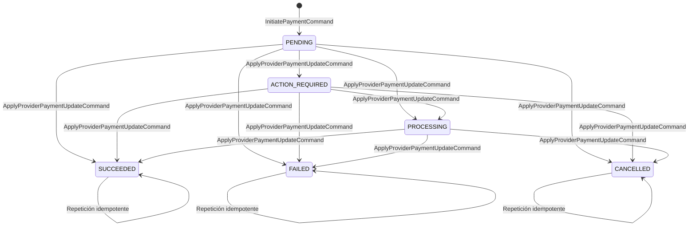

# Contratos iniciales de Finance

- **Estado:** Propuesto para revisión conjunta
- **Versión:** 1.0-inicial
- **Fecha:** 2026-07-26
- **Bounded Context:** Finance
- **Servicio:** `vankoo-finance-service`
- **ADR relacionado:** [ADR-0001](../adr/0001-axon-server-event-store-postgresql-read-model.md)

## Propósito

Este documento define los contratos iniciales del bounded context Finance antes
de implementar clases, controladores o configuraciones de infraestructura.

El contrato se divide en:

- modelo de dominio y comandos;
- eventos de dominio;
- eventos públicos de integración hacia Kafka;
- puerto de aplicación para proveedores de pago;
- consultas y Read Model;
- reglas de versionado, idempotencia y consistencia.

El dominio no dependerá de Axon, Kafka, PostgreSQL, Redis, HTTP ni del SDK de
Stripe. Esos detalles se conectarán desde `application`, `infrastructure` e
`interfaces`.

## Decisiones de alcance

### Agregado inicial

El primer agregado event-sourced será `Payment`. Será responsable del ciclo de
vida de un pago y de validar las transiciones permitidas.

Finance no definirá todavía un agregado `Account` o `Ledger`. La tabla de
balances podrá existir como una proyección futura, pero un pago exitoso no
actualizará directamente un saldo sin que antes se definan las reglas de
contabilidad, moneda, comisiones, reembolsos y chargebacks.

Esta restricción evita convertir una proyección de pagos en una fuente contable
implícita.

### Identificadores

- `paymentId`: UUID generado por Finance antes de enviar el comando de creación.
- `accountId`: UUID de la cuenta financiera asociada al pago. No representa
  directamente un usuario, JWT o proveedor externo.
- `providerPaymentId`: identificador opaco asignado por el proveedor de pago.
- `providerEventId`: identificador opaco del evento externo usado para
  deduplicar webhooks.
- `idempotencyKey`: clave opaca enviada por el cliente para evitar crear dos
  pagos por la misma intención.

Los identificadores se transportan como strings. El dominio no debe depender de
la representación textual concreta del UUID.

### Dinero

El dinero se representa como una cantidad entera en unidades menores y una
moneda ISO 4217:

```json
{
  "amountMinor": 12500,
  "currency": "PEN"
}
```

Reglas:

- `amountMinor` debe ser mayor que cero;
- no se utilizarán `float` ni `double` para dinero;
- `currency` debe estar en mayúsculas y ser una moneda soportada por Finance;
- no se permitirán cambios de moneda dentro del agregado `Payment`.

### Fechas y texto

- Las fechas se representan como ISO-8601 en UTC.
- Los textos de dominio deben tener límites definidos por el caso de uso.
- No se almacenarán números de tarjeta, CVV, secretos ni payloads crudos de
  Stripe dentro de eventos de dominio.

## Agregado `Payment`

### Estado



Los estados `SUCCEEDED`, `FAILED` y `CANCELLED` son terminales para la primera
versión. Una modificación posterior, como un reembolso, debe tener un contrato
propio y no reabrir el pago original.

### Comandos

Los comandos representan intenciones. No son hechos históricos y no se
persisten como eventos del agregado.

| Comando | Propósito | Campos obligatorios | Emisor esperado |
|---|---|---|---|
| `InitiatePaymentCommand` | Crear un pago en estado `PENDING`. | `paymentId`, `accountId`, `amount`, `provider`, `idempotencyKey`, `requestedAt` | API de Finance |
| `RegisterPaymentProviderCommand` | Asociar al pago la referencia creada por el proveedor. | `paymentId`, `provider`, `providerPaymentId`, `registeredAt` | Caso de uso de pagos |
| `ApplyProviderPaymentUpdateCommand` | Aplicar al agregado un estado normalizado desde un webhook o consulta del proveedor. | `paymentId`, `provider`, `providerPaymentId`, `providerEventId`, `status`, `observedAt` | Adaptador de proveedor |

Campos opcionales:

- `description` en `InitiatePaymentCommand`;
- `actionUrl` en `RegisterPaymentProviderCommand` cuando el usuario deba
  completar una acción;
- `failureReason` en `ApplyProviderPaymentUpdateCommand` cuando el estado sea
  `FAILED`;
- `cancellationReason` cuando el estado sea `CANCELLED`.

El `routingKey` de los comandos dirigidos a un pago será `paymentId`. Esto
permite que Axon Server dirija los comandos del mismo agregado a la instancia
correcta de `finance-service`.

### Eventos de dominio

Los eventos representan hechos que ya ocurrieron y forman parte del historial
del agregado en Axon Server.

| Evento | Cuándo se produce | Alcance inicial |
|---|---|---|
| `PaymentInitiatedEvent` | Se acepta la creación del pago. | Público potencial |
| `PaymentProviderRegisteredEvent` | Se registra la referencia del proveedor. | Interno |
| `PaymentActionRequiredEvent` | El proveedor requiere una acción del usuario. | Público potencial |
| `PaymentProcessingEvent` | El proveedor informa que el pago está en procesamiento. | Público potencial |
| `PaymentSucceededEvent` | El pago queda confirmado como exitoso. | Público |
| `PaymentFailedEvent` | El pago queda rechazado o fallido. | Público |
| `PaymentCancelledEvent` | El pago queda cancelado. | Público |

Los nombres expresan lenguaje de negocio y no contienen `Axon`, `Kafka`,
`Stripe`, `Postgres` ni nombres de clases de infraestructura.

### Datos de los eventos

`PaymentInitiatedEvent`:

```json
{
  "paymentId": "2b7f1f7d-9f67-4a46-9db8-f44ca7e43d0a",
  "accountId": "8b8c7f7e-f91d-4c13-9f18-1f0e9c8b3d21",
  "amountMinor": 12500,
  "currency": "PEN",
  "provider": "STRIPE"
}
```

`PaymentProviderRegisteredEvent` añade los datos técnicos necesarios para
continuar la integración, pero no debe publicarse automáticamente:

```json
{
  "paymentId": "2b7f1f7d-9f67-4a46-9db8-f44ca7e43d0a",
  "provider": "STRIPE",
  "providerPaymentId": "opaque-provider-reference",
  "actionUrl": "https://provider.example/action/opaque-reference"
}
```

`PaymentSucceededEvent`:

```json
{
  "paymentId": "2b7f1f7d-9f67-4a46-9db8-f44ca7e43d0a",
  "accountId": "8b8c7f7e-f91d-4c13-9f18-1f0e9c8b3d21",
  "amountMinor": 12500,
  "currency": "PEN",
  "provider": "STRIPE"
}
```

`PaymentFailedEvent` añade una razón normalizada de Finance:

```json
{
  "paymentId": "2b7f1f7d-9f67-4a46-9db8-f44ca7e43d0a",
  "accountId": "8b8c7f7e-f91d-4c13-9f18-1f0e9c8b3d21",
  "amountMinor": 12500,
  "currency": "PEN",
  "provider": "STRIPE",
  "failureReason": "DECLINED"
}
```

Las razones de fallo iniciales son `DECLINED`, `EXPIRED`,
`INVALID_PAYMENT_METHOD`, `PROVIDER_ERROR` y `UNKNOWN`. Los códigos internos
de Stripe no forman parte del contrato de dominio.

## Invariantes del agregado

1. Un pago debe tener un `paymentId`, `accountId`, importe, moneda y proveedor.
2. El importe debe ser positivo y la moneda debe ser válida.
3. La identidad, el importe, la moneda y la cuenta no pueden cambiar después
   de `PaymentInitiatedEvent`.
4. Solo se puede registrar una referencia de proveedor. Repetir exactamente la
   misma referencia es idempotente; intentar registrar otra es un conflicto.
5. Una actualización del proveedor debe coincidir con `provider` y
   `providerPaymentId` ya registrados.
6. Una transición desde un estado terminal se rechaza, excepto la repetición
   exacta del mismo evento externo, que debe ser idempotente.
7. `providerEventId` debe procesarse como máximo una vez por pago y proveedor.
8. Un evento externo no modifica directamente una tabla de balance: primero se
   traduce a un comando y el agregado decide qué evento de dominio producir.
9. El agregado no consulta PostgreSQL Read Model, Redis, Stripe ni Kafka para
   validar invariantes.

## Mapeo de proveedores externos

Stripe y otros proveedores se consideran entradas externas. El adaptador debe
traducir sus estados a la taxonomía de Finance antes de enviar el comando al
agregado:

| Situación externa normalizada | Estado de Finance |
|---|---|
| Requiere acción del usuario | `ACTION_REQUIRED` |
| En procesamiento | `PROCESSING` |
| Confirmado | `SUCCEEDED` |
| Rechazado o con error definitivo | `FAILED` |
| Cancelado o expirado | `CANCELLED` |

El dominio no recibirá un objeto `Stripe.Event`, `PaymentIntent` ni otro tipo
del SDK. La verificación de firma y la retención temporal del payload crudo
pertenecen a `infrastructure`.

## Contrato del puerto `PaymentProvider`

El puerto vive en `application` y utiliza modelos propios de Finance:

| Operación | Entrada | Salida | Responsabilidad |
|---|---|---|---|
| `createPayment` | `CreateProviderPaymentRequest` | `ProviderPaymentCreated` | Crear el recurso de pago externo. |
| `getPayment` | `ProviderPaymentReference` | `ProviderPaymentStatus` | Consultar el estado externo. |
| `verifyWebhook` | Payload crudo + firma | `VerifiedProviderPaymentUpdate` | Verificar autenticidad y normalizar el evento. |

El puerto no expone tipos de Stripe. La implementación Stripe vive en
`infrastructure` y puede traducir errores del SDK a errores propios de la
aplicación.

## Eventos de integración hacia Kafka

### Selección

En la primera versión se publicarán como eventos de integración los siguientes
eventos de dominio:

- `PaymentInitiatedEvent`;
- `PaymentActionRequiredEvent`, si otro bounded context necesita conocerlo;
- `PaymentProcessingEvent`, si otro bounded context necesita conocerlo;
- `PaymentSucceededEvent`;
- `PaymentFailedEvent`;
- `PaymentCancelledEvent`.

`PaymentProviderRegisteredEvent` será interno inicialmente porque expone una
referencia del proveedor y no representa por sí mismo un hecho que otros
bounded contexts deban consumir.

La regla es: un evento de dominio público y su evento de integración comparten
el mismo payload de negocio. No se publican `EventMessage` de Axon, clases
serializadas con el nombre completo del paquete ni objetos del SDK de Stripe.

### Topic y clave

- **Topic inicial:** `vankoo.finance.events.v1`
- **Key del registro:** `paymentId`
- **Formato:** JSON
- **Entrega:** al menos una vez
- **Orden:** garantizado por Kafka para registros con la misma key, sujeto a la
  configuración de particiones

### Headers de Kafka

Los metadatos técnicos se transportan en headers, no dentro del objeto de
dominio:

| Header | Obligatorio | Descripción |
|---|---:|---|
| `event-type` | Sí | Nombre del evento, por ejemplo `PaymentSucceededEvent`. |
| `event-version` | Sí | Versión del esquema, inicialmente `1`. |
| `event-id` | Sí | Identificador único del evento para deduplicación. |
| `aggregate-type` | Sí | Inicialmente `Payment`. |
| `aggregate-id` | Sí | Igual a `paymentId`. |
| `occurred-at` | Sí | Fecha UTC en formato ISO-8601. |
| `correlation-id` | Sí | Identifica la operación de negocio completa. |
| `causation-id` | No | Identifica el mensaje que causó este evento. |
| `content-type` | Sí | `application/json`. |

El `event-id` debe conservarse durante reintentos del productor. Los
consumidores deben deduplicar por `event-id` o por una clave de negocio
equivalente.

### Ejemplo de registro Kafka

Headers:

```text
event-type: PaymentSucceededEvent
event-version: 1
event-id: 1b8ed1ab-3ab9-4f8e-ae2e-9e158a3de8de
aggregate-type: Payment
aggregate-id: 2b7f1f7d-9f67-4a46-9db8-f44ca7e43d0a
occurred-at: 2026-07-26T15:30:00Z
correlation-id: 9fd7498c-8125-4a2c-88d4-ccbfecfd1a1a
content-type: application/json
```

Payload:

```json
{
  "paymentId": "2b7f1f7d-9f67-4a46-9db8-f44ca7e43d0a",
  "accountId": "8b8c7f7e-f91d-4c13-9f18-1f0e9c8b3d21",
  "amountMinor": 12500,
  "currency": "PEN",
  "provider": "STRIPE"
}
```

### Compatibilidad y versionado

- Los eventos del Event Store y los contratos Kafka se versionan de forma
  explícita.
- En la versión `1`, los consumidores deben tolerar campos nuevos que no
  utilicen.
- Eliminar o renombrar un campo obligatorio requiere una nueva versión mayor
  del contrato.
- No se cambia silenciosamente el significado de un evento existente.
- Una migración de eventos históricos de Axon Server requerirá upcasters o una
  estrategia equivalente antes de modificar el agregado.

## Read Model y consultas

El Read Model de PostgreSQL es una proyección, no una segunda fuente de verdad.
La primera proyección definida es `payment_view`:

| Campo | Propósito |
|---|---|
| `payment_id` | Identificador del pago. |
| `account_id` | Cuenta asociada. |
| `amount_minor` | Importe en unidades menores. |
| `currency` | Moneda ISO 4217. |
| `provider` | Proveedor normalizado. |
| `provider_payment_id` | Referencia externa, si existe. |
| `status` | Estado actual de Finance. |
| `action_url` | URL de acción, si aplica y sigue vigente. |
| `failure_reason` | Razón normalizada, si el pago falló. |
| `created_at` | Fecha de creación. |
| `updated_at` | Fecha de última proyección. |
| `last_event_id` | Último evento aplicado para idempotencia. |
| `projection_version` | Versión de la proyección. |

También se necesita un índice durable para resolver webhooks:

```text
payment_provider_reference
  UNIQUE(provider, provider_payment_id)
  UNIQUE(provider, provider_event_id)

payment_command_idempotency
  UNIQUE(account_id, idempotency_key)
  stores(payment_id, request_hash)
```

Este índice ayuda a resolver y deduplicar eventos externos, pero no reemplaza
el historial de eventos de Axon Server. La tabla de idempotencia de comandos
permite comprobar que una misma intención del cliente no cree dos pagos.

### Consultas lógicas iniciales

- `GetPaymentById(paymentId)`
- `ListPaymentsByAccount(accountId, filters, page)`

Las consultas no reconstruyen el agregado desde Axon Server. Leen el Read Model
y aceptan consistencia eventual después de un comando o una proyección
reprocesada.

### HTTP como adaptador

Los nombres de ruta son contratos lógicos y pueden recibir un prefijo del API
Gateway:

| Método | Ruta lógica | Resultado |
|---|---|---|
| `POST` | `/v1/payments` | Acepta `InitiatePaymentCommand`; requiere header `Idempotency-Key`. |
| `GET` | `/v1/payments/{paymentId}` | Devuelve el estado proyectado del pago. |
| `POST` | `/v1/payment-providers/{provider}/webhooks` | Verifica el webhook y traduce su resultado a un comando. |

El `POST /v1/payments` puede responder `202 Accepted` con `paymentId` y estado
`PENDING`. La creación del recurso externo y la actualización del Read Model
pueden ser asíncronas.

## Idempotencia, consistencia y fallos

### Comandos de cliente

- `Idempotency-Key` es obligatorio para iniciar un pago.
- La misma clave con el mismo contenido devuelve el mismo `paymentId`.
- La misma clave con contenido distinto produce un conflicto.

### Webhooks

- La firma se verifica antes de interpretar el payload.
- `providerEventId` es obligatorio y se deduplica por proveedor.
- Un webhook repetido no produce un nuevo evento de negocio.
- Un webhook válido para un pago inexistente no debe crear un pago; se registra
  para revisión y se aplica la política de reintento correspondiente.

### Kafka

- La publicación será at-least-once.
- Los reintentos pueden repetir un registro; el `event-id` no debe cambiar.
- Los consumidores deben ser idempotentes.
- Un fallo de Kafka no invalida el evento ya persistido en Axon Server.
- El productor debe tener reintentos, observabilidad y una estrategia de
  dead-letter definida antes de producción.

## Organización por capas

```text
domain/
└── payment/
    ├── Payment aggregate
    ├── commands
    ├── events
    ├── value objects
    └── business exceptions

application/
├── payment commands/use cases
├── query services
└── PaymentProvider port

infrastructure/
├── axon server configuration
├── postgres read-model projections
├── kafka publisher
└── stripe provider adapter

interfaces/
├── REST controllers and DTOs
└── webhook adapter
```

Los DTOs HTTP pueden tener una forma distinta de los comandos de dominio. Los
assemblers de `interfaces` y los casos de uso de `application` realizan esa
traducción.

## Elementos que no son contratos de negocio

No se documentan como eventos adicionales:

- `CommandMessage`, `EventMessage`, sequence number y metadata interna de Axon;
- headers, particiones, offsets y envelopes de Kafka;
- payload crudo, firma y tipos del SDK de Stripe;
- entidades JPA y tablas del Read Model;
- snapshots de Axon Server.

Son mecanismos técnicos que transportan, almacenan o proyectan los contratos
de negocio.

## Decisiones pendientes

- Confirmar con Anjali la taxonomía de estados que cada proveedor puede
  normalizar.
- Confirmar si `PaymentActionRequiredEvent` y `PaymentProcessingEvent` deben
  publicarse desde la primera versión.
- Confirmar el catálogo de monedas soportadas.
- Definir los límites de tamaño para descripción e identificadores externos.
- Definir el formato de errores HTTP común de Vankoo.
- Definir la política de retención y el dead-letter de Kafka.
- Diseñar el agregado o bounded contract de ledger antes de exponer balances
  contables.

## Criterios de aceptación del contrato

- [ ] El equipo puede describir el ciclo de vida completo de `Payment`.
- [ ] Cada transición tiene un comando, una validación y un evento definido.
- [ ] Los webhooks externos nunca actualizan directamente el Read Model.
- [ ] Los eventos públicos no contienen tipos de Stripe ni detalles de Axon.
- [ ] Los consumidores Kafka pueden deduplicar y versionar los eventos.
- [ ] El Read Model puede reconstruirse desde los eventos de Axon Server.
- [ ] Las reglas de dinero, estado e idempotencia están documentadas.
